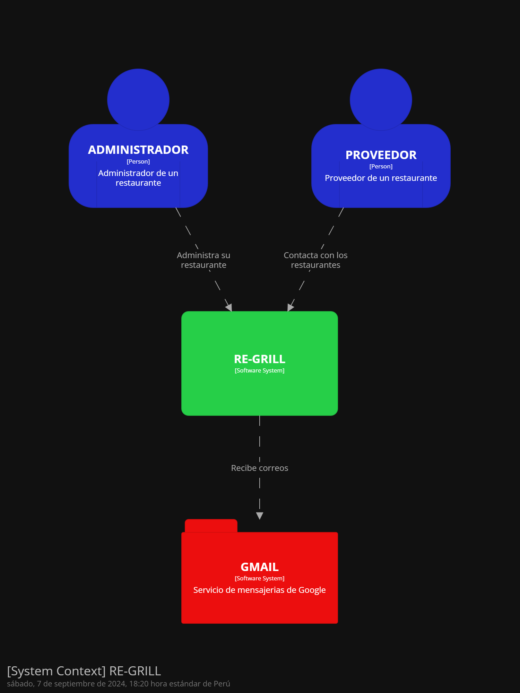
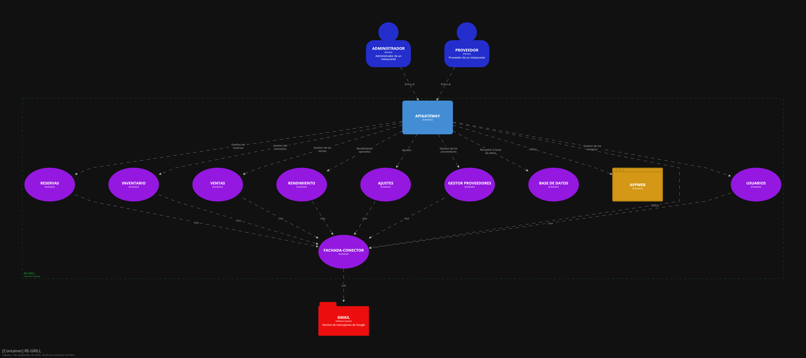
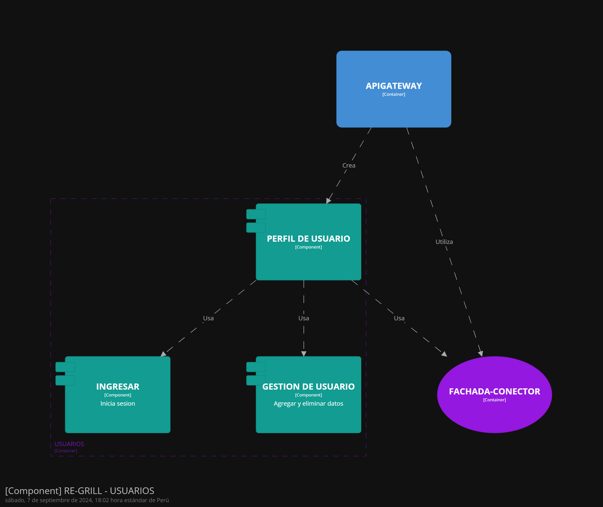
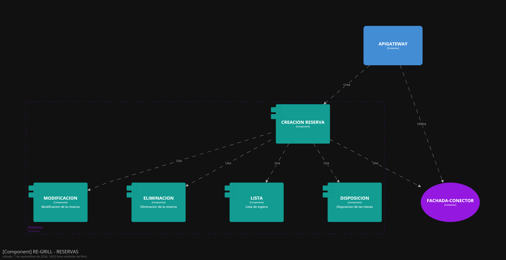
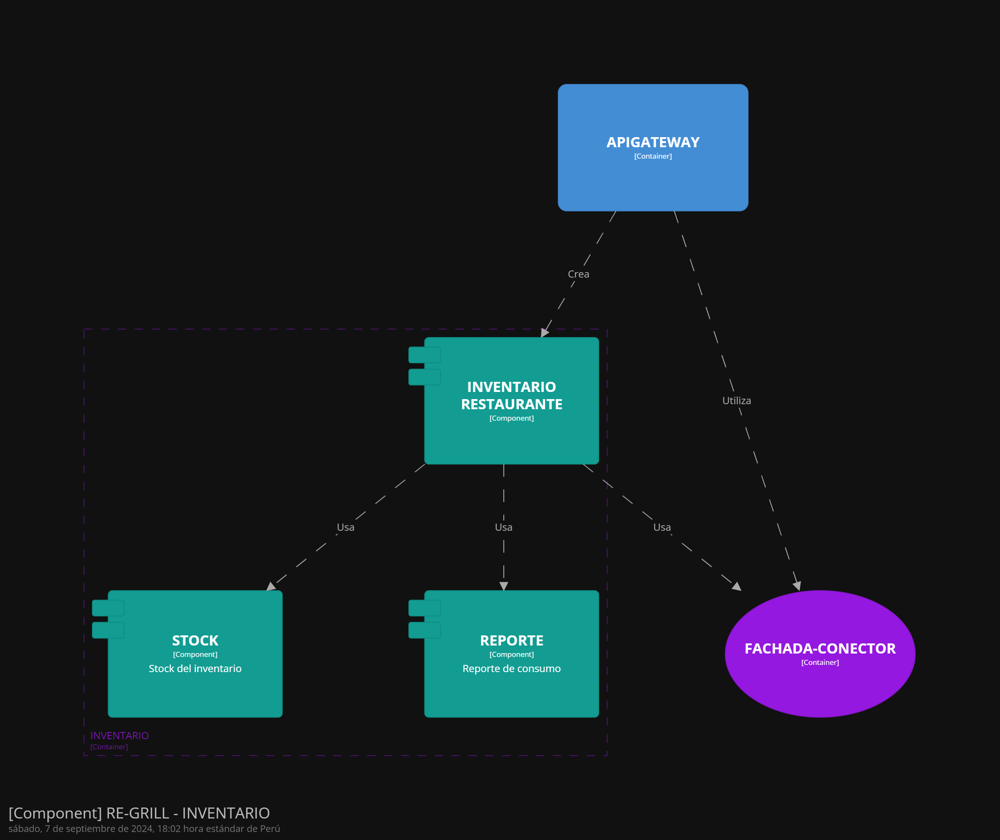
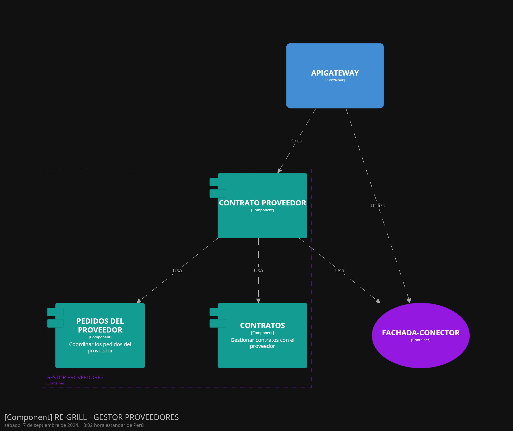
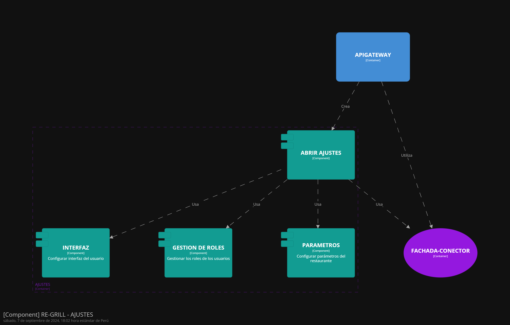

## Universidad Peruana de Ciencias Aplicadas - Informe de Trabajo Final

## Aplicaciones Web - SW52

### Integrantes:
- Holguin Gamarra, Hardie Alfonso - U202220250
- Huapaya Cuevas, Anthony Martin - U202220235
- Belahonia Miranda, Fabrisio Andre - U202220219
- Marzál Pérez, Jamir Ángel - U201824409
- Arce Huaman Luis Andres - U20201A300
- Garayar Mori, Oscar Nathaniel - U202014115

### Tabla de Contenidos

- [Universidad Peruana de Ciencias Aplicadas - Informe de Trabajo Final](#universidad-peruana-de-ciencias-aplicadas---informe-de-trabajo-final)
- [Aplicaciones Web - SW52](#aplicaciones-web---sw52)
  - [Integrantes:](#integrantes)
  - [Tabla de Contenidos](#tabla-de-contenidos)
  - [Registro de Versiones del Informe](#registro-de-versiones-del-informe)
  - [Student Outcome](#student-outcome)
  - [Capítulo I: Introducción](#capítulo-i-introducción)
  - [1.1. Startup Profile](#11-startup-profile)
  - [1.1.1. Descripción de la Startup](#111-descripción-de-la-startup)
    - [RestauMaster: Simplificando la Operación de Restaurantes](#restaumaster-simplificando-la-operación-de-restaurantes)
  - [1.1.2. Perfiles de integrantes del equipo](#112-perfiles-de-integrantes-del-equipo)
  - [1.2. Solution Profile](#12-solution-profile)
  - [1.2.1 Antecedentes y problemática](#121-antecedentes-y-problemática)
  - [1.2.2 Lean UX Process.](#122-lean-ux-process)
  - [1.2.2.1. Lean UX Problem Statements.](#1221-lean-ux-problem-statements)
  - [1.2.2.2. Lean UX Assumptions.](#1222-lean-ux-assumptions)
  - [1.2.2.3. Lean UX Hypothesis Statements.](#1223-lean-ux-hypothesis-statements)
  - [1.2.2.4. Lean UX Canvas.](#1224-lean-ux-canvas)
  - [1.3. Segmentos objetivo.](#13-segmentos-objetivo)
  - [Capítulo II: Requirements Elicitation \& Analysis](#capítulo-ii-requirements-elicitation--analysis)
  - [2.1. Competidores.](#21-competidores)
  - [2.1.1. Análisis competitivo.](#211-análisis-competitivo)
  - [2.1.2. Estrategias y tácticas frente a competidores.](#212-estrategias-y-tácticas-frente-a-competidores)
  - [2.2. Entrevistas.](#22-entrevistas)
  - [2.2.1. Diseño de entrevistas.](#221-diseño-de-entrevistas)
  - [2.2.2. Registro de entrevistas.](#222-registro-de-entrevistas)
  - [2.2.3. Análisis de entrevistas.](#223-análisis-de-entrevistas)
  - [2.3. Needfinding.](#23-needfinding)
  - [2.3.1. User Personas.](#231-user-personas)
  - [2.3.2. User Task Matrix.](#232-user-task-matrix)
  - [2.3.3. User Journey Mapping.](#233-user-journey-mapping)
  - [2.3.4. Empathy Mapping.](#234-empathy-mapping)
  - [2.3.5. As-is Scenario Mapping.](#235-as-is-scenario-mapping)
  - [2.4. Ubiquitous Language.](#24-ubiquitous-language)
  - [Capítulo III: Requirements Specification](#capítulo-iii-requirements-specification)
  - [3.1. To-Be Scenario Mapping.](#31-to-be-scenario-mapping)
  - [3.2. User Stories.](#32-user-stories)
  - [3.3. Impact Mapping.](#33-impact-mapping)
  - [3.4. Product Backlog.](#34-product-backlog)
  - [Capítulo IV: Product Design](#capítulo-iv-product-design)
  - [4.1. Style Guidelines.](#41-style-guidelines)
  - [4.1.1. General Style Guidelines.](#411-general-style-guidelines)
  - [4.1.2. Web Style Guidelines.](#412-web-style-guidelines)
  - [4.2. Information Architecture.](#42-information-architecture)
  - [4.2.1. Organization Systems.](#421-organization-systems)
  - [4.2.2. Labeling Systems.](#422-labeling-systems)
  - [4.2.3. SEO Tags and Meta Tags](#423-seo-tags-and-meta-tags)
  - [4.2.4. Searching Systems.](#424-searching-systems)
  - [4.2.5. Navigation Systems.](#425-navigation-systems)
  - [4.3. Landing Page UI Design.](#43-landing-page-ui-design)
  - [4.3.1. Landing Page Wireframe.](#431-landing-page-wireframe)
  - [4.3.2. Landing Page Mock-up.](#432-landing-page-mock-up)
  - [4.4. Web Applications UX/UI Design.](#44-web-applications-uxui-design)
  - [4.4.1. Web Applications Wireframes.](#441-web-applications-wireframes)
  - [4.4.2. Web Applications Wireflow Diagrams.](#442-web-applications-wireflow-diagrams)
  - [4.4.2. Web Applications Mock-ups.](#442-web-applications-mock-ups)
  - [4.4.3. Web Applications User Flow Diagrams.](#443-web-applications-user-flow-diagrams)
  - [4.5. Web Applications Prototyping.](#45-web-applications-prototyping)
  - [4.6. Domain-Driven Software Architecture.](#46-domain-driven-software-architecture)
  - [4.6.1. Software Architecture Context Diagram.](#461-software-architecture-context-diagram)
  - [4.6.2. Software Architecture Container Diagrams.](#462-software-architecture-container-diagrams)
  - [4.6.3. Software Architecture Components Diagrams.](#463-software-architecture-components-diagrams)
  - [4.7. Software Object-Oriented Design.](#47-software-object-oriented-design)
  - [4.7.1. Class Diagrams.](#471-class-diagrams)
  - [4.7.2. Class Dictionary.](#472-class-dictionary)
  - [4.8. Database Design.](#48-database-design)
  - [4.8.1. Database Diagram.](#481-database-diagram)
  - [Capítulo V: Product Implementation, Validation \& Deployment](#capítulo-v-product-implementation-validation--deployment)
  - [5.1. Software Configuration Management.](#51-software-configuration-management)
  - [5.1.1. Software Development Environment Configuration.](#511-software-development-environment-configuration)
  - [5.1.2. Source Code Management.](#512-source-code-management)
  - [5.1.3. Source Code Style Guide \& Conventions.](#513-source-code-style-guide--conventions)
  - [5.1.4. Software Deployment Configuration.](#514-software-deployment-configuration)
  - [5.2. Landing Page, Services \& Applications Implementation.](#52-landing-page-services--applications-implementation)
  - [5.2.1. Sprint n](#521-sprint-n)
  - [5.2.1.1. Sprint Planning n.](#5211-sprint-planning-n)
  - [5.2.1.2. Sprint Backlog n.](#5212-sprint-backlog-n)
  - [5.2.1.3. Development Evidence for Sprint Review.](#5213-development-evidence-for-sprint-review)
  - [5.2.1.4. Testing Suite Evidence for Sprint Review.](#5214-testing-suite-evidence-for-sprint-review)
  - [5.2.1.5. Execution Evidence for Sprint Review.](#5215-execution-evidence-for-sprint-review)
  - [5.2.1.6. Services Documentation Evidence for Sprint Review.](#5216-services-documentation-evidence-for-sprint-review)
  - [5.2.1.7. Software Deployment Evidence for Sprint Review.](#5217-software-deployment-evidence-for-sprint-review)
  - [5.2.1.8. Team Collaboration Insights during Sprint.](#5218-team-collaboration-insights-during-sprint)
  - [5.3. Validation Interviews.](#53-validation-interviews)
  - [5.3.1. Diseño de Entrevistas.](#531-diseño-de-entrevistas)
  - [5.3.2. Registro de Entrevistas.](#532-registro-de-entrevistas)
  - [5.3.3. Evaluaciones según heurísticas.](#533-evaluaciones-según-heurísticas)
  - [5.4. Video About-the-Product.](#54-video-about-the-product)
  - 
  - [Conclusiones](#conclusiones)
  - [Conclusiones y recomendaciones.](#conclusiones-y-recomendaciones)
  - [Video About-the-Team.](#video-about-the-team)
  - [Bibliografía](#bibliografía)
  - [Anexos](#anexos)

### Registro de Versiones del Informe

### Student Outcome

### Capítulo I: Introducción

### 1.1. Startup Profile

### 1.1.1. Descripción de la Startup

#### RestauMaster: Simplificando la Operación de Restaurantes

RestauMaster es una startup que busca transformar la manera en que los restaurantes gestionan sus operaciones diarias. Nos especializamos en ofrecer una plataforma integral que conecta todas las áreas clave de un restaurante, desde la gestión de mesas y reservas hasta la administración de cocina, ventas, y stock. Nuestro objetivo es automatizar y optimizar procesos operativos para mejorar la eficiencia y la experiencia del cliente. En RestauMaster, estamos comprometidos con la innovación en la industria gastronómica, proporcionando herramientas que facilitan la operación diaria, reducen costos y elevan los estándares de servicio en los restaurantes del siglo XXI.

### 1.1.2. Perfiles de integrantes del equipo

| **Oscar Nathaniel Garayar Mori - U202014115**                       | **Foto**                             |
|---------------------------------------------------------------------|--------------------------------------|
| Mi nombre es Oscar Garayar, estudiante de Ing. de software. Voy cursando el 6to ciclo de mi carrera, y me considero alguien responsable que, a pesar de las complicaciones, encontrará una forma de seguir adelante. Tengo experiencia con los lenguajes C++, Python y Java. |  |

prueba 2

### 1.2. Solution Profile
### 1.2.1 Antecedentes y problemática
### 1.2.2 Lean UX Process.
### 1.2.2.1. Lean UX Problem Statements.
- Hemos detectado problemas al momento de gestionar los recursos que se tienen en un restaurante, donde hay problemas con respecto a las cantidades que se tienen en el momento y las mermas que se hacen.
- Se detectaron problemas al momento de contactarse con los proveedores para reponer los productos que están a punto de agotarse el stock para su pronta preparación de las comidas.
### 1.2.2.2. Lean UX Assumptions.
**Assumptions Worksheet** 
**¿Quién es el usuario?**
- La parte administrativa de un restaurante
- Los proveedores de restaurantes

**¿Qué problemas tiene nuestro producto? ¿Resolver?**
- Gestión con los productos que se tienen en el restaurante
- Comunicación con los proveedores de alimentos para los ingredientes de sus platillos a la carta

**¿Qué características son importantes?**
- Una mejor forma de contactarse entre la parte administrativa y el proveedor para la reponer los productos
- Mejorar la atención del cliente con los platillos que se encuentran disponibles en dicho momento.
- Organización de las cantidades de los productos, ya sea comestibles o de mantenimiento.
- Interfaz amigable para cualquier usuario que lo use.

**¿Dónde encaja nuestro producto en su trabajo o vida?**
- Para la administración, nuestro producto les ayudará a gestionar los ingredientes de los platos que cocinan, además de conocer los desperdicios que hay al momento de cocinar y las cantidades de mesas, sillas, entre otros.
- Para los proveedores, el producto los ayudará en mejorar la comunicación entre ellos y la administración del restaurante, además de brindar las cantidades exactas que necesita el restaurante.

**¿Cuándo y cómo es nuestro producto? ¿Usado?**
- El producto será utilizado cuando la administración del restaurante comienza a gestionar el inventario que posee actualmente, además de ver si las cantidades son las suficientes para las preparaciones al momento de atender.
- El producto será usado por algunos proveedores de restaurantes, donde podrán visualizar los distintos restaurantes que necesitan contactarse con algún proveedor de algún consumible.
- El producto será a través de una aplicación web mediante algún dispositivo que usa internet y un navegador como Chrome.

**¿Cómo debe verse nuestro producto y cómo comportarse?**
- El diseño de nuestro producto debe ser atractivo y coherente con respecto al diseño del restaurante.
- La plataforma debe cargar de manera rápida las respuestas a las acciones del usuario para que no se frustre.
- La navegación de la plataforma debe ser intuitiva y comprensible, donde los usuarios pueden ver los filtros necesarios y las distintas opciones que tiene.
- Debe mostrar a los clientes con gráficos y una pequeña descripción acerca del plato de comida que busca.
- Esta plataforma debe ser compatible con algunos dispositivos de dimensiones distintas, como celulares, laptops, tablets y computadoras, donde se usa un diseño responsive.

**Business Outcomes** 
- Convertir nuestro producto como una plataforma indispensable para la gestión de restaurantes, ya sea en la manera de reponer el inventario, organización del mismo local y la atención de los clientes.
- Un 75% de los usuarios que usaron la página han logrado gestionar de mejor manera los restaurantes.
- Un 20% de los clientes de restaurantes se muestran insatisfechos con la atención que brinda los restaurantes.

**User Benefits** 
- Ahorro de tiempo por la manera de gestionar el inventario.
- Facilidad en buscar los productos faltantes o desperdiciados.
- Mejor comunicación entre el proveedor y la administración.

**Assumptions Steps** 
**a. Creo que mis clientes necesitan:**
  - Visualización de disponibilidad de platillos.
  - Expresar de manera intuitiva el inventario que se lleva en el local
  - Comunicarse de manera eficiente con otro tipo de usuario

**b. Estas necesidades se pueden resolver con:**
  - Un sistema que calcula lo que hay en el inventario en general y lo que se usa al día.
  - Una base de datos que se actualiza cada vez que cambia y se use parte de lo que hay en el inventario.
  - Un diseño que sea muy atractivo visualmente y a la vez entendible para gestionar el restaurante.
  - Accesibilidad para su uso en distintos dispositivos según lo que el usuario usará.

**c. Mis clientes iniciales son (o serán):**
  - La parte administrativa de un restaurante.
  - Los proveedores o vendedores de alimentos para los restaurantes.

**d. El valor #1 que un cliente quiere de mi producto es veracidad (utilidad, funcionalidades que le resuelven el problema)**
  - La garantía de que no habrá problemas en las cantidades con respecto al inventario por la base de datos.
  - La comunicación de manera directa con el proveedor con respecto a la necesidad del restaurante.

**e. El cliente también puede obtener estos beneficios adicionales:**
  - Obtener las cantidades de la merma que se obtiene al hacer un plato.
  - Mejorar la administración del restaurante.          

**f. Voy a adquirir la mayoría de mis clientes a través de:**
  - Colaboración con un restaurante conocido.
  - Estrategias de marketing digital con el enfoque en los distintos restaurantes.

**g. Haré dinero a través de:**
  - Membresías premium con acceso exclusivo y funciones adicionales

**h. Mi competencia principal en el mercado:**
  - Tiendas virtuales de restaurantes que se enfocan en las ventas.
  - Páginas de gestión de restaurantes.

**i. Los venceremos debido a:**
  - El diseño es atractivo y accesible para cualquier tipo de usuario ya sea la administración o el proveedor.
  - La base de datos actualizada constantemente con respecto a la necesidad del usuario.

**j. Mi mayor riesgo del producto es:**
  - La desconfianza por parte de los restaurantes con respecto a la correcta función del programa al momento de tener días especiales.
  - El mal cálculo del inventario al momento de mostrar las cantidades de cada producto que se encuentra disponible.

**k. Resolveremos esto a través de:**
  - Mostrando pruebas funcionales de esto y su adaptabilidad ante algún problema que se muestra de manera sorpresiva.
  - Las constantes verificaciones que se realizará al momento de que se haga alguna compra.

**l. ¿Qué otras suposiciones tenemos? ¿Eso, si se prueba que es falso, causará que nuestro negocio / proyecto no funcione?**
  - Podrá ser que las estrategias de marketing que se usa podrán ayudar a obtener más compañías que le darán uso de la aplicación. En caso se muestre el contrario, podría afectar de manera negativa la inversión del negocio.
  - Las ventas de las suscripciones para obtener más funciones que les será muy útil para mejorar su experiencia con la página. Si se prueba que es falso, afectaría de manera directa con la generación de ingresos y sostenibilidad del negocio.

### 1.2.2.3. Lean UX Hypothesis Statements.
**Hypothesis 1:**

Creemos que al tener suscripciones de pago ayudará a que los usuarios puedan obtener algunas herramientas de manera exclusiva que los regulares, además de ayudarnos a evaluar sobre el interés que existe sobre su uso.
Sabremos que hemos tenido éxito
Cuando veamos un aumento significativo con los números de clientes que usan suscripciones premium.

**Hypothesis 2:**

Creemos que al optimizar y mejorar la manera de gestionar el inventario de los administradores de un restaurante podrá mejorar la eficiencia con respecto a las cantidades de ventas que produzca
Sabremos que hemos tenido éxito
Cuando veamos el incremento de ventas del restaurante con platos que antes no se vendía tanto por la falta de ingredientes que tienen, además de un aumento de clientes.

**Hypothesis 3:**

Creemos que al implementar un sistema que ayuda a los proveedores vender sus productos a los restaurantes afiliados a nuestra plataforma y que necesita algo de ello
Sabremos que hemos tenido éxito
Cuando aumenta más las cantidades de proveedores que venden a distintos restaurantes por los productos que necesitan estos.

### 1.2.2.4. Lean UX Canvas.
<table border="1" style="text-align: left;">  
  <tr>
    <th style="text-align: center;">Business Problem</th>
    <th style="text-align: center;">Solution Ideas</th>
    <th style="text-align: center;">Business Outcomes</th>
  </tr>
  <tr>
    <td>
        <ul>
            <li>Gestión de recursos en un restaurante por las cantidades que hay en el inventario.</li>
            <li>Contacto entre la administración de un restaurante y los proveedores de estos.</li>
        </ul>
    </td>
    <td rowspan="2">
        <ul>
            <li>Cuando veamos un aumento significativo con los números de clientes que usan suscripciones premium.</li>
            <li>Cuando veamos el incremento de ventas del restaurante con platos que antes no se vendía tanto por la falta de ingredientes que tienen, además de un aumento de clientes.</li>
            <li>Cuando aumenta más las cantidades de proveedores que venden a distintos restaurantes por los productos que necesitan estos.</li>
        </ul>
    </td>
    <td>
        <ul>
            <li>Convertir nuestro producto como una plataforma indispensable para la gestión de restaurantes, ya sea en la manera de reponer el inventario, organización del mismo local y la atención de los clientes.</li>
            <li>Un 75% de los usuarios que usaron la página han logrado gestionar de mejor manera los restaurantes.</li>
            <li>Un 20% de los clientes de restaurantes se muestran insatisfechos con la atención que brinda los restaurantes.</li>
        </ul>
    </td>
  </tr>
  <tr>
    <th style="text-align: center;">Users</th>
    <th style="text-align: center;">User Benefits</th>
  </tr>
  <tr>
    <td>
        <ul>
            <li>Administración del restaurante</li>
            <li>Proveedores de restaurantes</li>
        </ul>
    </td>
    <th style="text-align: center;">What’s the most important thing we need to learn first?</th>
    <td>
        <ul>
            <li>Ahorro de tiempo por la manera de gestionar el inventario.</li>
            <li>Facilidad en buscar los productos faltantes o desperdiciados.</li>
            <li>Mejor comunicación entre el proveedor y la administración.</li>
        </ul>
    </td>
  </tr>
  <tr>
    <th style="text-align: center;">Hypotheses</th>
    <td rowspan="2">
        <ul>
            <li>Entender de mejor manera los problemas de gestión con los inventarios que administra los restaurantes.</li>
            <li>Comprender el funcionamiento de los sistemas de suscripciones con respecto al tema de los restaurantes</li>
        </ul>
    </td>
    <th style="text-align: center;">What’s the least amount of work we need to do learn the next most important thing?</th>
  </tr>
  <tr>
    <td>
        <ul>
            <li>Creemos que al tener suscripciones de pago ayudará a que los usuarios puedan obtener algunas herramientas de manera exclusiva que los regulares, además de ayudarnos a evaluar sobre el interés que existe sobre su uso.</li>
            <li>Creemos que al optimizar y mejorar la manera de gestionar el inventario de los administradores de un restaurante podrá mejorar la eficiencia con respecto a las cantidades de ventas que produzca.</li>
            <li>Creemos que al implementar un sistema que ayuda a los proveedores vender sus productos a los restaurantes afiliados a nuestra plataforma y que necesita algo de ello.</li>
        </ul>
    </td>
    <td>
        <ul>
            <li>Entrevistar a los distintos administradores de restaurantes y cómo se comunica con los proveedores.</li>
            <li>Constantes feedback con respecto al manejo de la página, ya sea por algunos de nuestros principales usuarios.</li>
        </ul>
    </td>
  </tr>
</table>

### 1.3. Segmentos objetivo.
- **Segmento objetivo 1:** Administradores de restaurantes 
  **Geografía:** Perú 
  **Demografía:** Entre 20 a 35 años con experiencia en administración
- **Segmento objetivo 2:** Proveedores 
  **Geografía:** Perú 
  **Demografía:** Entre 20 a 40 años, vendedores de alimentos

### Capítulo II: Requirements Elicitation & Analysis
### 2.1. Competidores.
### 2.1.1. Análisis competitivo.
### 2.1.2. Estrategias y tácticas frente a competidores.
### 2.2. Entrevistas.
### 2.2.1. Diseño de entrevistas.
### 2.2.2. Registro de entrevistas.
### 2.2.3. Análisis de entrevistas.
### 2.3. Needfinding.
### 2.3.1. User Personas.
### 2.3.2. User Task Matrix.
### 2.3.3. User Journey Mapping.
### 2.3.4. Empathy Mapping.
### 2.3.5. As-is Scenario Mapping.
### 2.4. Ubiquitous Language.
### Capítulo III: Requirements Specification
### 3.1. To-Be Scenario Mapping.
### 3.2. User Stories.
### 3.3. Impact Mapping.
### 3.4. Product Backlog.
### Capítulo IV: Product Design
### 4.1. Style Guidelines.
### 4.1.1. General Style Guidelines.
### 4.1.2. Web Style Guidelines.
### 4.2. Information Architecture.
### 4.2.1. Organization Systems.
### 4.2.2. Labeling Systems.
### 4.2.3. SEO Tags and Meta Tags
### 4.2.4. Searching Systems.
### 4.2.5. Navigation Systems.
### 4.3. Landing Page UI Design.
### 4.3.1. Landing Page Wireframe.
### 4.3.2. Landing Page Mock-up.
### 4.4. Web Applications UX/UI Design.
### 4.4.1. Web Applications Wireframes.
### 4.4.2. Web Applications Wireflow Diagrams.
### 4.4.2. Web Applications Mock-ups.
### 4.4.3. Web Applications User Flow Diagrams.
### 4.5. Web Applications Prototyping.
### 4.6. Domain-Driven Software Architecture.
### 4.6.1. Software Architecture Context Diagram.

### 4.6.2. Software Architecture Container Diagrams.

### 4.6.3. Software Architecture Components Diagrams.
<ul>
  <li>
    
Usuarios

    
  </li>
  <li>
    
Ventas

    
  </li>
  <li>
    
Reservas

    
  </li>
  <li>
    
Rendimiento

    
  </li>
  <li>
    
Inventario

    
  </li>
  <li>
    
Gestor de proveedores

    
  </li>
  <li>
    
Ajustes

    
  </li>
</ul>

### 4.7. Software Object-Oriented Design.
### 4.7.1. Class Diagrams.
### 4.7.2. Class Dictionary.
### 4.8. Database Design.
### 4.8.1. Database Diagram.
### Capítulo V: Product Implementation, Validation & Deployment
### 5.1. Software Configuration Management.
### 5.1.1. Software Development Environment Configuration.
### 5.1.2. Source Code Management.
### 5.1.3. Source Code Style Guide & Conventions.
### 5.1.4. Software Deployment Configuration.
### 5.2. Landing Page, Services & Applications Implementation.
### 5.2.1. Sprint n
### 5.2.1.1. Sprint Planning n.
### 5.2.1.2. Sprint Backlog n.
### 5.2.1.3. Development Evidence for Sprint Review.
### 5.2.1.4. Testing Suite Evidence for Sprint Review.
### 5.2.1.5. Execution Evidence for Sprint Review.
### 5.2.1.6. Services Documentation Evidence for Sprint Review.
### 5.2.1.7. Software Deployment Evidence for Sprint Review.
### 5.2.1.8. Team Collaboration Insights during Sprint.
### 5.3. Validation Interviews.
### 5.3.1. Diseño de Entrevistas.
### 5.3.2. Registro de Entrevistas.
### 5.3.3. Evaluaciones según heurísticas.
### 5.4. Video About-the-Product.
###  
### Conclusiones
### Conclusiones y recomendaciones.
### Video About-the-Team.
### Bibliografía
### Anexos
