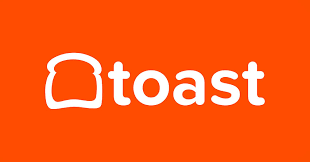
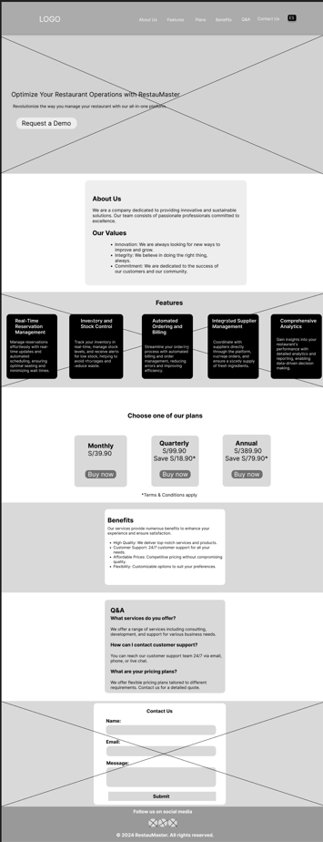
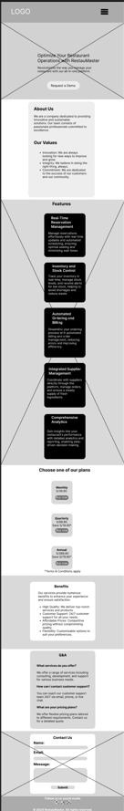
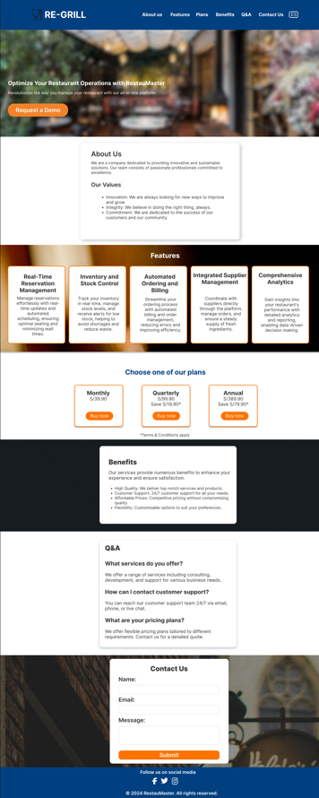

<p align="center" id="caratula">
    <strong>Universidad Peruana de Ciencias Aplicadas</strong><br>
    <br>
    <strong>Ingeniería de Software</strong><br>
    <strong>SI730 Aplicaciones Web | SECCIÓN SW52</strong><br>
    <strong>Profesor:Tinoco Licas, Juan Carlos </strong><br>
    <br>INFORME DE TRABAJO FINAL
</p>

<p align="center">
    <strong>Startup: Re-Grill</strong><br>
    <strong>Producto: RestauMaster</strong>
</p>
<div>
    <h3 align="center">Integrantes:</h3>
</div>

<div align="center">
     <table>
        <tr>
            <th style="text-align:center;">Integrante</th>
            <th style="text-align:center;">Código</th>
        </tr>
        <tr>
            <td>Holguin Gamarra, Hardie Alfonso</td>
            <td>U202220250</td>
        </tr>
        <tr>
            <td>Huapaya Cuevas, Anthony Martin </td>
            <td>U202220235</td>
        </tr>
        <tr>
            <td>Belahonia Miranda, Fabrisio Andre </td>
            <td>U202220219</td>
        </tr>
        <tr>
            <td>Marzál Pérez, Jamir Ángel </td>
            <td>U201824409</td>
        </tr>
        <tr>
            <td>Arce Huaman Luis Andres</td>
            <td>U202220219</td>
        </tr>
	 <tr>
            <td>Garayar Mori, Oscar Nathaniel</td>
            <td>U20201A300</td>
        </tr>
    </table>
</div>

<p align="center">
    <strong>Setiembre 2024</strong>
</p>

### Registro de Versiones del Informe
| Version | Fecha | Autor | Descripcion de Modificacion |
| ----------- | ----------- | ----------- | ----------- |
| 0.0 | 17/08/2024 | Re-GRILL | Se crea el documento y plantilla de trabajo |
| 1.0 | 22/08/2024 | Re-GRILL | Se crea la organización y repositorio en GitHub. |
| 2.0 | 25/08/2024 | Re-GRILL |Desarrollo del Capitulo I: Introducción|
| 3.0 | 27/08/2024 | Re-GRILL |Desarrollo del Capitulo II: Requeriments Elicitation & Analysis|
| 4.0 | 29/09/2024 | Re-GRILL|Desarrollo del Capitulo III: Requirements Specification|
| 5.0 | 31/09/2024 | Re-GRILL |Desarrollo del Capitulo IV: Product Design|


<h4 id="student-outcome"> Student Outcome</h4>
Criterio: Demuestra capacidad de comunicarse efectivamente con un rango de audiencias
<p>En el siguiente cuadro se describe las acciones realizadas y enunciados de 
conclusiones cual por parte del grupo, que permiten sustentar el haber 
alcanzado el logro del ABET – EAC - Student Outcome 3.</p>


<table><thead>
  <tr>
    <th>Criterio específico</th>
    <th>Acciones realizadas</th>
    <th>Conclusiones</th>
  </tr></thead>
<tbody>
  <tr>
    <td>Demuestra capacidad de comunicarse efectivamente con un rango de audiencias</td>
    <td><b> Huapaya Cuevas, Anthony Martin	</b><br>
TB1: En este caso yo realize todo el capitulo numero 5 , el cual incluye Software Configuration Management, Landing Page, Services & Applications Implementation y Validation Interviews.

<br><b> Belahonia Miranda, Fabrisio Andre</b>   <br>
TB1: Para esta entrega yo realize el punto 4, el cual incluye Product design,Styles guidelines,Information architecture,Landing page and  UI design

<br><b> Hardie Alfonso Holguín Gamarra</b><br>
TB1: Yo me encargue de el capitulo 3 , el cual incluye Requirements Specification, To-Be Scenario Mapping, User Stories, Impact Mapping y Product Backlog.

<br><b> Marzál Pérez, Jamir Ángel</b> <br>
TB1: En esta entrega , se implemento todo el capitulo 1 , en este caso el startup profile , el solution profile , los antecedentes y problematica y todos los puntos del Lean UX Process.

<br><br><b> Arce Huaman Luis Andresl</b>
TB1: Yo realize todo el capitulo 2 para esta entrega , incluyendo los competidores , las entrevistas , el needfinding y el ubiquitous language.


<br><br><b> Garayar Mori, Oscar Nathaniel</b>
TB1: Yo realize todo el capitulo 1 para esta entrega , incluyendo los competidores , las entrevistas , el needfinding y el ubiquitous language.

</td>
    <td>Se lograron los objetivos establecidos<br>gracias a la constante comunicación y<br>organización de<br>nuestro equipo para la correcta elaboración e<br>implementación del presente proyecto</td>
  </tr>
  <tr>
  </tr>
</tbody>
</table>


|Criterio Especifico|Acciones Realizadas|Conclusiones|
|-|-|-|
| Trabaja en equipo para proporcionar liderazgo en forma conjunta | Nombre: Fabrisio Belahonia: <br> TB1: <br> El trabajo en equipo para proporcionar liderazgo conjunto fue esencial en el desarrollo de la startup. Desde la elaboración de entrevistas hasta el análisis de competidores y el diseño de estrategias, cada miembro contribuyó activamente. Esto fue clave para la creación exitosa de los User Personas, User Task Matrix y User Journey Mapping, cuyo éxito dependió de la colaboración de todo el equipo. Además, el diseño de wireframes, prototipos y diagramas técnicos reflejó una integración sólida y coherente entre todas las áreas del proyecto. |
| Crea un entorno colaborativo e inclusivo, establece metas, planifica tareas y cumple objetivos|Nombre: Fabrisio Belahonia: <br> TB1: <br> Crear un entorno colaborativo e inclusivo fue esencial para el éxito del desarrollo de la startup. El equipo trabajó junto para establecer metas claras, planificar tareas y cumplir objetivos. La colaboración abierta permitió realizar entrevistas efectivas, analizar competidores y diseñar estrategias de manera conjunta. Al desarrollar los User Personas, User Task Matrix y User Journey Mapping, se lograron construir las user stories, que guiaron el diseño de las pantallas en Figma. Este enfoque inclusivo y participativo ayudó a reflejar todas las perspectivas y asegurar que el prototipo final cumpliera con las necesidades del proyecto.|

# Contenido

1. [Capítulo I: Introducción](#cap1)<br>
   1.1. [Startup Profile](#1.1.)<br>
      1.1.1. [Descripción del startup](#1.1.1.)<br>
      1.1.2. [Perfiles de los integrantes del equipo](#1.1.2.)<br>
   1.2. [Solution Profile](#1.2.)<br>
      1.2.1. [Antecedentes y Problemática](#1.2.1.)<br>
      1.2.2. [Lean UX Process](#1.2.2.)<br>
        1.2.2.1. [Lean UX Problem Statements](#1.2.2.1.)<br>
        1.2.2.2. [Lean UX Assumptions](#1.2.2.2.)<br>
        1.2.2.3. [Lean UX Hypothesis Statements](#1.2.2.3.)<br>
        1.2.2.4. [Lean UX Canvas](#1.2.2.4.)<br>
   1.3. [Segmentos objetivo](#1.3.)<br>
2. [Capítulo II: Requirements Elicitation & Analysis](#cap2)<br>
   2.1. [Competidores](#2.1.)<br>
      2.1.1. [Análisis competitivo](#2.1.1.)<br>
      2.1.2. [Estrategias y tácticas frente a competidores](#2.1.2.)<br>
   2.2. [Entrevistas](#2.2.)<br>
      2.2.1. [Diseño de entrevistas](#2.2.1.)<br>
      2.2.2. [Registro de entrevistas](#2.2.2.)<br>
      2.2.3. [Análisis de entrevistas](#2.2.3.)<br>
   2.3. [Needfinding](#2.3.)<br>
      2.3.1. [User Personas](#2.3.1.)<br>
      2.3.2. [User Task Matrix](#2.3.2.)<br>
      2.3.3. [User Journey Mapping](#2.3.3.)<br>
      2.3.4. [Empathy Mapping](#2.3.4.)<br>
      2.3.5. [As-is Scenario Mapping](#2.3.5.)<br>
   2.4. [Ubiquitous Language](#2.4.) <br>
3. [Capítulo III: Requirements Specification](#cap3)<br>
   3.1. [To-Be Scenario Mapping](#3.1.)<br>
   3.2. [User Stories](#3.2.)<br>
   3.3. [Impact Mapping](#3.3.)<br>
   3.4. [Product Backlog](#3.4.)<br>
4. [Capítulo IV: Product Design](#cap4)<br>
   4.1. [Style Guidelines](#4.1.)<br>
      4.1.1. [General Style Guidelines](#4.1.1.)<br>
      4.1.2. [Web Style Guidelines](#4.1.2.)<br>
   4.2. [Information Architecture](#4.2.)<br>
      4.2.1. [Organization Systems](#4.2.1.)<br>
      4.2.2. [Labeling Systems](#4.2.2.)<br>
      4.2.3. [SEO Tags and Meta Tags](#4.2.3.)<br>
      4.2.4. [Searching Systems](#4.2.4.)<br>
      4.2.5. [Navigation Systems](#4.2.5.)<br>
   4.3. [Landing Page UI Design](#4.3.)<br>
      4.3.1. [Landing Page Wireframe](#4.3.1.)<br>
      4.3.2. [Landing Page Mock-up](#4.3.2.)<br>
   4.4. [Web Applications UX/UI Design](#4.4.)<br>
      4.4.1. [Web Applications Wireframes](#4.4.1.)<br>
      4.4.2. [Web Applications Wireflow Diagrams](#4.4.2.)<br>
      4.4.3. [Web Applications Mock-ups](#4.4.3.)<br>
      4.4.4. [Web Applications User Flow Diagrams](#4.4.4.)<br>
   4.5. [Web Applications Prototyping](#4.5.)<br>
   4.6. [Domain-Driven Software Architecture](#4.6.)<br>
      4.6.1. [Software Architecture Context Diagram](#4.6.1.)<br>
      4.6.2. [Software Architecture Container Diagrams](#4.6.2.)<br>
      4.6.3. [Software Architecture Components Diagrams](#4.6.3.)<br>
   4.7. [Software Object-Oriented Design](#4.7.)<br>
      4.7.1. [Class Diagrams](#4.7.1.)<br>
      4.7.2. [Class Dictionary](#4.7.2.)<br>
   4.8. [Database Design](#4.8.)<br>
      4.8.1. [Database Diagram](#4.8.1.)<br>
5. [Capítulo V: Product Implementation, Validation & Deployment](#cap5)<br>
   5.1. [Software Configuration Management](#5.1.)<br>
      5.1.1. [Software Development Environment Configuration](#5.1.1.)<br>
      5.1.2. [Source Code Management](#5.1.2.)<br>
      5.1.3. [Source Code Style Guide & Conventions](#5.1.3.)<br>
      5.1.4. [Software Deployment Configuration](#5.1.4.)<br>
   5.2. [Landing Page, Services & Applications Implementation](#5.2.)<br>
      5.2.1. [Sprint 1](#5.2.1.)<br>
         5.2.1.1. [Sprint Planning 1](#5.2.1.1.)<br>
         5.2.1.2. [Sprint Backlog 1](#5.2.1.2.)<br>
         5.2.1.3. [Development Evidence for Sprint Review](#5.2.1.3.)<br>
         5.2.1.4. [Testing Suite Evidence for Sprint Review](#5.2.1.4.)<br>
         5.2.1.5. [Execution Evidence for Sprint Review](#5.2.1.5.)<br>
         5.2.1.6. [Services Documentation Evidence for Sprint Review.](#5.2.1.6.)<br>
         5.2.1.7. [Software Deployment Evidence for Sprint Review.](#5.2.1.7.)<br>
         5.2.1.8. [Team Collaboration Insights during Sprint.](#5.2.1.8.)<br>
6. [Conclusiones](#conclusiones)<br>
7. [Bibliografía](#bibliografía)<br>
8. [Anexos](#anexos) <br>

   


# Capítulo I: Introducción <a name ="cap1">


## 1.1. Startup Profile <a name ="1.1.">

### 1.1.1. Descripción de la Startup <a name ="1.1.1.">

#### RestauMaster: Simplificando la Operación de Restaurantes

RestauMaster es una startup que busca transformar la manera en que los restaurantes gestionan sus operaciones diarias. Nos especializamos en ofrecer una plataforma integral que conecta todas las áreas clave de un restaurante, desde la gestión de mesas y reservas hasta la administración de cocina, ventas, y stock. Nuestro objetivo es automatizar y optimizar procesos operativos para mejorar la eficiencia y la experiencia del cliente. En RE-GRILL, estamos comprometidos con la innovación en la industria gastronómica, proporcionando herramientas que facilitan la operación diaria, reducen costos y elevan los estándares de servicio en los restaurantes del siglo XXI.

#### 1.1.2. Perfiles de integrantes del equipo <a name ="1.1.2.">

| **Oscar Nathaniel Garayar Mori - U202014115**                       | **Foto**                             |
|---------------------------------------------------------------------|--------------------------------------|
| Mi nombre es Oscar Garayar, estudiante de Ing. de software. Voy cursando el 6to ciclo de mi carrera, y me considero alguien responsable que, a pesar de las complicaciones, encontrará una forma de seguir adelante. Tengo experiencia con los lenguajes C++, Python y Java. |  |

| **Luis Andres Arce Huaman - U20201A300**                       | **Foto**                             |
|---------------------------------------------------------------------|--------------------------------------|
|Mi nombre es Luis Arce, soy estudiante de la carrera de Ing de Software cursando mi 6to ciclo de mi carrera , me gusta el arte la danza y la tecnologia. He estudiado diversos lenguajes de programación en el transcurso de mi carrera y por mi mismo. Soy una persona confiable y muy tolerante. |  |

| **Jamir Ángel Marzál Pérez - U201824409**                       | **Foto**                             |
|---------------------------------------------------------------------|--------------------------------------|
|Me llamo Jamir, soy estudiante de la carrera de Ingeniería de Software. Mis principales cualidades son el trabajo en equipo, la escucha activa, ética, creatividad, eficacia y responsabilidad. Tengo conocimientos en lenguajes de  programación C++, C# y Python |  |

| **Fabrisio Andre Belahonia Miranda - U202220219**                       | **Foto**                             |
|---------------------------------------------------------------------|--------------------------------------|
| Mi nombre es Fabrisio Belahonia, estudiante de Ing. de software. Voy cursando el 5to ciclo de mi carrera, y me considero una persona responsable, ordenado, empático. Me interesa el área de Ciberseguridad y tengo experiencia con Linux, Redes, Cloud, etc.|  |

| **Anthony Martin Huapaya Cuevas - U202220235**                       | **Foto**                             |
|---------------------------------------------------------------------|--------------------------------------|
| Mi nombre es Anthony Huapaya, soy estudiante de Ing. De Software y voy cursando el 5to ciclo. Me considero alguien que se adapta a la situación que se presenta, tengo buena comunicación con los integrantes del grupo. Mi experiencia con los lenguajes son C++ y un poco de Python.|  |

| **Hardie Alfonso Holguin Gamarra - U202220250**                       | **Foto**                             |
|---------------------------------------------------------------------|--------------------------------------|
| Soy Hardie Holguín, Estudio la carrera de ingeniería de software en la Universidad Peruana de Ciencias Aplicadas (UPC). Soy una persona disciplinada y organizada. En mi tiempo libre me gusta entrenar en el gimnasio y jugar futbol.|  |


## 1.2. Solution Profile <a name ="1.2.">

En el competitivo mundo de la gastronomía, la gestión eficiente de las operaciones se ha convertido en un pilar fundamental para asegurar un servicio de alta calidad y una experiencia excepcional para los clientes. Sin embargo, los métodos tradicionales de administración de restaurantes, desde la gestión de mesas y reservas hasta el control de inventarios y la coordinación con proveedores, pueden ser complejos, lentos y propensos a errores. Esta realidad ha generado una necesidad urgente de encontrar soluciones innovadoras que permitan a los restaurantes optimizar estos procesos críticos de manera más eficiente y efectiva.

En este contexto, surge una nueva era en la gestión de restaurantes, donde la tecnología y la inteligencia operativa se combinan para ofrecer soluciones integrales, ágiles y precisas. La búsqueda de métodos más inteligentes para coordinar la operación de los restaurantes se ha convertido en una prioridad para los profesionales que buscan maximizar la eficiencia, reducir costos y mejorar la experiencia del cliente. RE-GRILL se posiciona a la vanguardia de esta transformación, proporcionando herramientas tecnológicas que simplifican la gestión diaria y permiten a los restaurantes enfocarse en lo más importante: brindar una experiencia gastronómica inolvidable.

### 1.2.1 Antecedentes y problemática <a name ="1.2.1.">

##### What

- Los métodos tradicionales de gestión en restaurantes, como la organización de mesas, reservas y control de inventarios, suelen ser laboriosos, costosos y propensos a errores.
- Los gerentes y personal del restaurante deben coordinar múltiples tareas manualmente, lo que puede llevar a ineficiencias operativas y problemas de comunicación.
- Esto puede resultar en pérdida de clientes, insatisfacción y aumento de costos debido a errores humanos y procedimientos ineficientes.

##### Who

- Gerentes de restaurantes y personal de servicio se ven afectados por la complejidad y la carga de trabajo que implican los métodos tradicionales de gestión.
- Clientes enfrentan retrasos y errores en sus reservas y pedidos, lo que afecta su experiencia general en el restaurante.

##### Where

- Esta problemática es común en restaurantes de cualquier tamaño, desde pequeños locales hasta grandes cadenas, donde la eficiencia operativa es crucial para el éxito del negocio.

###### When

- La problemática surge en el día a día de las operaciones del restaurante, especialmente durante los periodos de alta demanda, como las horas pico y eventos especiales, donde la coordinación y eficiencia son esenciales.

##### Why

- La falta de automatización y herramientas integradas para la gestión de operaciones dificulta la eficiencia y aumenta la probabilidad de errores.
- La falta de visibilidad en tiempo real sobre el inventario, las reservas y los pedidos lleva a decisiones menos informadas y puede generar desperdicio de recursos y pérdidas financieras.


##### How

- En un restaurante típico, el personal puede requerir mucho tiempo para coordinar manualmente las reservas, gestionar las mesas, controlar el inventario y comunicarse con la cocina y los proveedores. - Con "RE-GRILL", este proceso se agiliza significativamente, permitiendo una gestión más fluida y eficiente de todas las áreas del restaurante en cuestión de minutos.
- El problema sigue un patrón de ineficiencia y desorganización en la gestión diaria. El personal a menudo se ve abrumado por la cantidad de tareas operativas y la falta de herramientas eficientes para manejarlas de manera rápida y precisa.

##### How Much

- En un día, un restaurante puede perder ingresos significativos debido a la ineficiencia en la gestión de reservas, pedidos y stock. Con "RE-GRILL", estas pérdidas pueden reducirse en un 50%.
- En términos de pérdida de ingresos y eficiencia operativa, un restaurante sin automatización adecuada podría estar perdiendo el equivalente a miles de soles mensuales debido a errores en la gestión y desperdicio de recursos. Con "RE-GRILL", se pueden minimizar estos retrasos y optimizar el uso de recursos en todas las áreas del restaurante.

### 1.2.2 Lean UX Process. <a name ="1.2.2.">
#### 1.2.2.1. Lean UX Problem Statements. <a name ="1.2.2.1.">
- Hemos detectado problemas al momento de gestionar los recursos que se tienen en un restaurante, donde hay problemas con respecto a las cantidades que se tienen en el momento y las mermas que se hacen.
- Se detectaron problemas al momento de contactarse con los proveedores para reponer los productos que están a punto de agotarse el stock para su pronta preparación de las comidas.
#### 1.2.2.2. Lean UX Assumptions. <a name ="1.2.2.2.">
**Assumptions Worksheet**<br>
**¿Quién es el usuario?**
- La parte administrativa de un restaurante
- Los proveedores de restaurantes

**¿Qué problemas tiene nuestro producto? ¿Resolver?**
- Gestión con los productos que se tienen en el restaurante
- Comunicación con los proveedores de alimentos para los ingredientes de sus platillos a la carta

**¿Qué características son importantes?**
- Una mejor forma de contactarse entre la parte administrativa y el proveedor para la reponer los productos
- Mejorar la atención del cliente con los platillos que se encuentran disponibles en dicho momento.
- Organización de las cantidades de los productos, ya sea comestibles o de mantenimiento.
- Interfaz amigable para cualquier usuario que lo use.

**¿Dónde encaja nuestro producto en su trabajo o vida?**
- Para la administración, nuestro producto les ayudará a gestionar los ingredientes de los platos que cocinan, además de conocer los desperdicios que hay al momento de cocinar y las cantidades de mesas, sillas, entre otros.
- Para los proveedores, el producto los ayudará en mejorar la comunicación entre ellos y la administración del restaurante, además de brindar las cantidades exactas que necesita el restaurante.

**¿Cuándo y cómo es nuestro producto? ¿Usado?**
- El producto será utilizado cuando la administración del restaurante comienza a gestionar el inventario que posee actualmente, además de ver si las cantidades son las suficientes para las preparaciones al momento de atender.
- El producto será usado por algunos proveedores de restaurantes, donde podrán visualizar los distintos restaurantes que necesitan contactarse con algún proveedor de algún consumible.
- El producto será a través de una aplicación web mediante algún dispositivo que usa internet y un navegador como Chrome.

**¿Cómo debe verse nuestro producto y cómo comportarse?**
- El diseño de nuestro producto debe ser atractivo y coherente con respecto al diseño del restaurante.
- La plataforma debe cargar de manera rápida las respuestas a las acciones del usuario para que no se frustre.
- La navegación de la plataforma debe ser intuitiva y comprensible, donde los usuarios pueden ver los filtros necesarios y las distintas opciones que tiene.
- Debe mostrar a los clientes con gráficos y una pequeña descripción acerca del plato de comida que busca.
- Esta plataforma debe ser compatible con algunos dispositivos de dimensiones distintas, como celulares, laptops, tablets y computadoras, donde se usa un diseño responsive.

**Business Outcomes**<br>
- Convertir nuestro producto como una plataforma indispensable para la gestión de restaurantes, ya sea en la manera de reponer el inventario, organización del mismo local y la atención de los clientes.
- Un 75% de los usuarios que usaron la página han logrado gestionar de mejor manera los restaurantes.
- Un 20% de los clientes de restaurantes se muestran insatisfechos con la atención que brinda los restaurantes.

**User Benefits**<br>
- Ahorro de tiempo por la manera de gestionar el inventario.
- Facilidad en buscar los productos faltantes o desperdiciados.
- Mejor comunicación entre el proveedor y la administración.

**Assumptions Steps**<br>
**a. Creo que mis clientes necesitan:**
  - Visualización de disponibilidad de platillos.
  - Expresar de manera intuitiva el inventario que se lleva en el local
  - Comunicarse de manera eficiente con otro tipo de usuario

**b. Estas necesidades se pueden resolver con:**
  - Un sistema que calcula lo que hay en el inventario en general y lo que se usa al día.
  - Una base de datos que se actualiza cada vez que cambia y se use parte de lo que hay en el inventario.
  - Un diseño que sea muy atractivo visualmente y a la vez entendible para gestionar el restaurante.
  - Accesibilidad para su uso en distintos dispositivos según lo que el usuario usará.

**c. Mis clientes iniciales son (o serán):**
  - La parte administrativa de un restaurante.
  - Los proveedores o vendedores de alimentos para los restaurantes.

**d. El valor #1 que un cliente quiere de mi producto es veracidad (utilidad, funcionalidades que le resuelven el problema)**
  - La garantía de que no habrá problemas en las cantidades con respecto al inventario por la base de datos.
  - La comunicación de manera directa con el proveedor con respecto a la necesidad del restaurante.

**e. El cliente también puede obtener estos beneficios adicionales:**
  - Obtener las cantidades de la merma que se obtiene al hacer un plato.
  - Mejorar la administración del restaurante.          

**f. Voy a adquirir la mayoría de mis clientes a través de:**
  - Colaboración con un restaurante conocido.
  - Estrategias de marketing digital con el enfoque en los distintos restaurantes.

**g. Haré dinero a través de:**
  - Membresías premium con acceso exclusivo y funciones adicionales

**h. Mi competencia principal en el mercado:**
  - Tiendas virtuales de restaurantes que se enfocan en las ventas.
  - Páginas de gestión de restaurantes.

**i. Los venceremos debido a:**
  - El diseño es atractivo y accesible para cualquier tipo de usuario ya sea la administración o el proveedor.
  - La base de datos actualizada constantemente con respecto a la necesidad del usuario.

**j. Mi mayor riesgo del producto es:**
  - La desconfianza por parte de los restaurantes con respecto a la correcta función del programa al momento de tener días especiales.
  - El mal cálculo del inventario al momento de mostrar las cantidades de cada producto que se encuentra disponible.

**k. Resolveremos esto a través de:**
  - Mostrando pruebas funcionales de esto y su adaptabilidad ante algún problema que se muestra de manera sorpresiva.
  - Las constantes verificaciones que se realizará al momento de que se haga alguna compra.

**l. ¿Qué otras suposiciones tenemos? ¿Eso, si se prueba que es falso, causará que nuestro negocio / proyecto no funcione?**
  - Podrá ser que las estrategias de marketing que se usa podrán ayudar a obtener más compañías que le darán uso de la aplicación. En caso se muestre el contrario, podría afectar de manera negativa la inversión del negocio.
  - Las ventas de las suscripciones para obtener más funciones que les será muy útil para mejorar su experiencia con la página. Si se prueba que es falso, afectaría de manera directa con la generación de ingresos y sostenibilidad del negocio.

#### 1.2.2.3. Lean UX Hypothesis Statements. <a name ="1.2.2.3.">
**Hypothesis 1:**

Creemos que al tener suscripciones de pago ayudará a que los usuarios puedan obtener algunas herramientas de manera exclusiva que los regulares, además de ayudarnos a evaluar sobre el interés que existe sobre su uso.
Sabremos que hemos tenido éxito
Cuando veamos un aumento significativo con los números de clientes que usan suscripciones premium.

**Hypothesis 2:**

Creemos que al optimizar y mejorar la manera de gestionar el inventario de los administradores de un restaurante podrá mejorar la eficiencia con respecto a las cantidades de ventas que produzca
Sabremos que hemos tenido éxito
Cuando veamos el incremento de ventas del restaurante con platos que antes no se vendía tanto por la falta de ingredientes que tienen, además de un aumento de clientes.

**Hypothesis 3:**

Creemos que al implementar un sistema que ayuda a los proveedores vender sus productos a los restaurantes afiliados a nuestra plataforma y que necesita algo de ello
Sabremos que hemos tenido éxito
Cuando aumenta más las cantidades de proveedores que venden a distintos restaurantes por los productos que necesitan estos.

#### 1.2.2.4. Lean UX Canvas. <a name ="1.2.2.4.">
<table border="1" style="text-align: left;">  
  <tr>
    <th style="text-align: center;">Business Problem</th>
    <th style="text-align: center;">Solution Ideas</th>
    <th style="text-align: center;">Business Outcomes</th>
  </tr>
  <tr>
    <td>
        <ul>
            <li>Gestión de recursos en un restaurante por las cantidades que hay en el inventario.</li>
            <li>Contacto entre la administración de un restaurante y los proveedores de estos.</li>
        </ul>
    </td>
    <td rowspan="2">
        <ul>
            <li>Cuando veamos un aumento significativo con los números de clientes que usan suscripciones premium.</li>
            <li>Cuando veamos el incremento de ventas del restaurante con platos que antes no se vendía tanto por la falta de ingredientes que tienen, además de un aumento de clientes.</li>
            <li>Cuando aumenta más las cantidades de proveedores que venden a distintos restaurantes por los productos que necesitan estos.</li>
        </ul>
    </td>
    <td>
        <ul>
            <li>Convertir nuestro producto como una plataforma indispensable para la gestión de restaurantes, ya sea en la manera de reponer el inventario, organización del mismo local y la atención de los clientes.</li>
            <li>Un 75% de los usuarios que usaron la página han logrado gestionar de mejor manera los restaurantes.</li>
            <li>Un 20% de los clientes de restaurantes se muestran insatisfechos con la atención que brinda los restaurantes.</li>
        </ul>
    </td>
  </tr>
  <tr>
    <th style="text-align: center;">Users</th>
    <th style="text-align: center;">User Benefits</th>
  </tr>
  <tr>
    <td>
        <ul>
            <li>Administración del restaurante</li>
            <li>Proveedores de restaurantes</li>
        </ul>
    </td>
    <th style="text-align: center;">What’s the most important thing we need to learn first?</th>
    <td>
        <ul>
            <li>Ahorro de tiempo por la manera de gestionar el inventario.</li>
            <li>Facilidad en buscar los productos faltantes o desperdiciados.</li>
            <li>Mejor comunicación entre el proveedor y la administración.</li>
        </ul>
    </td>
  </tr>
  <tr>
    <th style="text-align: center;">Hypotheses</th>
    <td rowspan="2">
        <ul>
            <li>Entender de mejor manera los problemas de gestión con los inventarios que administra los restaurantes.</li>
            <li>Comprender el funcionamiento de los sistemas de suscripciones con respecto al tema de los restaurantes</li>
        </ul>
    </td>
    <th style="text-align: center;">What’s the least amount of work we need to do learn the next most important thing?</th>
  </tr>
  <tr>
    <td>
        <ul>
            <li>Creemos que al tener suscripciones de pago ayudará a que los usuarios puedan obtener algunas herramientas de manera exclusiva que los regulares, además de ayudarnos a evaluar sobre el interés que existe sobre su uso.</li>
            <li>Creemos que al optimizar y mejorar la manera de gestionar el inventario de los administradores de un restaurante podrá mejorar la eficiencia con respecto a las cantidades de ventas que produzca.</li>
            <li>Creemos que al implementar un sistema que ayuda a los proveedores vender sus productos a los restaurantes afiliados a nuestra plataforma y que necesita algo de ello.</li>
        </ul>
    </td>
    <td>
        <ul>
            <li>Entrevistar a los distintos administradores de restaurantes y cómo se comunica con los proveedores.</li>
            <li>Constantes feedback con respecto al manejo de la página, ya sea por algunos de nuestros principales usuarios.</li>
        </ul>
    </td>
  </tr>
</table>

## 1.3. Segmentos objetivo. <a name ="1.3.">
- **Segmento objetivo 1:** Administradores de restaurantes<br>
  **Geografía:** Perú<br>
  **Demografía:** Entre 20 a 35 años con experiencia en administración
- **Segmento objetivo 2:** Proveedores<br>
  **Geografía:** Perú<br>
  **Demografía:** Entre 20 a 40 años, vendedores de alimentos

# Capítulo II: Requirements Elicitation & Analysis <a name ="cap2">
## 2.1. Competidores. <a name ="2.1.">

**Toast POS**

Toast es un sistema de punto de venta (POS) todo en uno diseñado específicamente para la industria de la restauración. Ofrece funcionalidades para la gestión de pedidos, pagos, inventario y análisis de datos, además de herramientas para la gestión de mesas y reservas. También incluye capacidades para pedidos en línea y delivery. Sus puntos fuertes incluyen ser una plataforma integral con herramientas avanzadas de análisis y reportes, y la integración con servicios de delivery y pedidos en línea.

**Square for Restaurants**

Square for Restaurants es un sistema POS que ofrece soluciones completas para la gestión de restaurantes, incluyendo la administración de mesas, pedidos, facturación, inventario y análisis. Se destaca por su facilidad de uso, la integración con otras herramientas de Square, y su flexibilidad y escalabilidad, adaptándose tanto a pequeños cafés como a grandes cadenas de restaurantes.

**Upserve by Lightspeed**

Upserve es una plataforma de gestión de restaurantes que ofrece un sistema POS robusto con capacidades avanzadas de gestión de inventarios, reportes de ventas y análisis de comportamiento de los clientes. Incluye funciones para la administración de mesas y reservas, y está diseñado para mejorar la eficiencia operativa. Sus puntos fuertes son los análisis detallados y herramientas de optimización, la integración con servicios de terceros, y el soporte especializado en la industria restaurantera.


### 2.1.1. Análisis competitivo. <a name ="2.1.1.">

# Competitive Analysis Landscape

Este análisis es llevado a cabo porque se busca conocer cuáles son las ventajas y desventajas que presenta nuestra aplicación frente a la competencia.

<table border="1" style="text-align: left;">
  <tr>
    <th style="text-align: center;">Restaurante</th>
    <th style="text-align: center;">RE-Grill <br></th>
    <th style="text-align: center;">Toast POS <br>   </th>
    <th style="text-align: center;">Square <br>  </th>
    <th style="text-align: center;">Upserve <br> </th>
  </tr>
  <tr>
    <th style="text-align: center;">Perfil</th>
    <td>Plataforma integral que gestiona mesas, reservas, cocina, ventas, inventarios, merma, y pedidos de insumos con conexión directa a proveedores para una coordinación eficiente.</td>
    <td>Sistema POS todo en uno para restaurantes, que cubre pedidos, pagos, inventario, mesas, reservas, y pedidos en línea, con análisis avanzado y servicios de delivery.</td>
    <td>Sistema POS flexible para la gestión completa de restaurantes, incluyendo administración de mesas, pedidos, facturación, inventario y análisis, con fácil escalabilidad.</td>
    <td>Sistema POS avanzado para restaurantes, con capacidades de gestión de inventarios, reportes de ventas y análisis del comportamiento del cliente, para mejorar la eficiencia operativa.</td>
  </tr>
  <tr>
    <th style="text-align: center;">Ventaja competitiva</th>
    <td>Ofrece una solución completa con integración directa a proveedores, optimizando la gestión interna y la cadena de suministro, facilitando la coordinación y reduciendo los costos operativos.</td>
    <td>Integra herramientas avanzadas de análisis y reportes, junto con capacidades robustas para delivery y pedidos en línea, mejorando la eficiencia operativa y el servicio al cliente.</td>
    <td>Ofrece facilidad de uso y flexibilidad, con integración fluida con otras herramientas de Square y escalabilidad para adaptarse al crecimiento del negocio.</td>
    <td>Proporciona análisis detallados y herramientas de optimización, integraciones con terceros y soporte especializado, ayudando a mejorar la eficiencia y la toma de decisiones.</td>
  </tr>
  <tr>
    <th style="text-align: center;">Perfil de Marketing</th>
    <th colspan="4" style="text-align: center;"></th>
  </tr>
  <tr>
    <th style="text-align: center;">Mercado Objetivo</th>
    <td>Restaurantes y proveedores de insumos</td>
    <td>Restaurantes</td>
    <td>Restaurantes</td>
    <td>Restaurantes</td>
  </tr>
  <tr>
    <th style="text-align: center;">Estrategias de Marketing</th>
    <td>Marketing de contenidos, testimonios de éxito, asociaciones estratégicas, publicidad digital</td>
    <td>Publicidad digital, marketing de referencia, eventos y ferias del sector</td>
    <td>Publicidad digital, demostraciones en directo, ofertas promocionales, colaboraciones estratégicas</td>
    <td>Publicidad digital, demostraciones personalizadas, eventos y ferias del sector</td>
  </tr>
  <tr>
    <th style="text-align: center;">Perfil de Producto</th>
    <th colspan="4" style="text-align: center;"></th>
  </tr>
  <tr>
    <th style="text-align: center;">Productos & Servicios</th>
    <td>Sistema de gestión integral para restaurantes con conexión a proveedores de insumos</td>
    <td>Un sistema todo en uno para la industria de la restauración</td>
    <td>Un sistema flexible y escalable diseñado para la gestión completa de restaurantes</td>
    <td>Un sistema flexible y escalable diseñado para la gestión completa de restaurantes</td>
  </tr>
  <tr>
    <th style="text-align: center;">Precios & Costos</th>
    <td>Variados</td>
    <td>Variados</td>
    <td>Variados</td>
    <td>Variados</td>
  </tr>
  <tr>
    <th style="text-align: center;">Canales de Distribución</th>
    <td>Web</td>
    <td>Web/Móvil</td>
    <td>Móvil</td>
    <td>Web/Móvil</td>
  </tr>
  <tr>
    <th style="text-align: center;">Análisis SWOT</th>
    <th colspan="4" style="text-align: center;"></th>
  </tr>
  <tr>
    <th style="text-align: center;">Fortalezas</th>
    <td>Conexión directa entre proveedores y restaurante, automatización de procesos, capacidades avanzadas en gestión de inventarios y reportes.</td>
    <td>Herramientas avanzadas de análisis y reportes. Integración con servicios de delivery y pedidos en línea. Personalización y soporte técnico especializado.</td>
    <td>Facilidad de uso y rápida implementación. Flexibilidad y escalabilidad para adaptarse a diferentes tamaños de negocios. Costos iniciales bajos y estructura de precios transparente.</td>
    <td>Capacidades avanzadas en gestión de inventarios y reportes. Análisis detallado del comportamiento de clientes y optimización operativa. Integración con servicios de terceros y soporte especializado en la industria restaurantera.</td>
  </tr>
  <tr>
    <th style="text-align: center;">Debilidades</th>
    <td>Dependencia de internet y posibles problemas de conectividad.</td>
    <td>Costos relativamente altos, lo que puede ser una barrera para pequeños negocios. Dependencia de una conexión a internet estable para funcionar óptimamente.</td>
    <td>Funcionalidades avanzadas pueden ser limitadas en comparación con competidores más especializados. Menor personalización en comparación con plataformas más robustas.</td>
    <td>Costos relativamente altos, especialmente para negocios pequeños. Complejidad en la configuración inicial y curva de aprendizaje para nuevos usuarios. Dependencia de la conexión a internet para la funcionalidad completa del sistema.</td>
  </tr>
  <tr>
    <th style="text-align: center;">Oportunidades</th>
    <td>Creciente demanda del mercado. Expansión en mercados internacionales.</td>
    <td>Expansión en mercados internacionales. Aumento en la demanda de soluciones para pedidos en línea y delivery.</td>
    <td>Expansión a mercados de tamaño medio y grande que buscan soluciones flexibles. Mejora de características y funciones mediante actualizaciones y adquisiciones.</td>
    <td>Creciente demanda de soluciones de análisis de datos. Expansión en mercados internacionales.</td>
  </tr>
  <tr>
    <th style="text-align: center;">Amenazas</th>
    <td>Competencia con mercados similares. Cambios en las necesidades del mercado.</td>
    <td>Competencia con mercados similares. Cambios en las necesidades del mercado.</td>
    <td>Competencia con mercados similares. Cambios en las necesidades del mercado.</td>
    <td>Competencia con mercados similares. Cambios en las necesidades del mercado.</td>
  </tr>
</table>


### 2.1.2. Estrategias y tácticas frente a competidores. <a name ="2.1.2.">

**Incorporar Tecnología de Vanguardia**

Inviertir en tecnologías emergentes como inteligencia artificial (IA) y análisis predictivo para mejorar la precisión en la gestión de inventarios y la previsión de demanda. Destacar estas características avanzadas en los esfuerzos de marketing y asegurarse de mantener la plataforma actualizada con las últimas innovaciones tecnológicas.

**Marketing**

Organizar eventos y webinars que resalten cómo Baratie utiliza tecnología avanzada para optimizar la cadena de suministro. Invitar a expertos en tecnología y clientes satisfechos para compartir sus experiencias y demostrar el valor de la plataforma.

**Demuestra la Tecnología Avanzada en Marketing**

Crear contenido educativo, como blogs, videos y webinars, que ilustre cómo Baratie optimiza la cadena de suministro mediante tecnología avanzada. Destacar el uso de algoritmos de previsión de demanda, análisis en tiempo real y automatización para aumentar la eficiencia. Publicar estudios de caso que evidencien la reducción de costos y la mejora en la gestión de inventarios. Utilizar testimonios en video para resaltar estos beneficios de manera efectiva.

**Formación en Optimización**

Ofrecer capacitación especializada sobre cómo utilizar la tecnología avanzada de Baratie para optimizar la cadena de suministro. Esto no solo ayudará a tus clientes a maximizar el uso de la plataforma, sino que también posicionará a Baratie como un experto.

## 2.2. Entrevistas. <a name ="2.2.">

### 2.2.1. Diseño de entrevistas. <a name ="2.2.1.">

**Preguntas para administradores**

¿Cuáles son sus principales responsabilidades en la gestión diaria del restaurante?<br>
¿Cómo gestiona actualmente el inventario de insumos y la supervisión de la merma?<br>
¿Qué desafíos enfrenta al controlar la disponibilidad de mesas y la cantidad de sillas?<br>
¿Cómo se asegura de que las reservas estén correctamente asignadas a las mesas disponibles?<br>
¿Cómo maneja la conexión entre los módulos de ventas, cocina, y stock?<br>
¿Cuál es su opinión sobre la automatización de procesos entre estos módulos?<br>
¿Cómo realiza los pedidos de insumos a los proveedores actualmente?<br>
¿Qué estrategias utiliza para reducir la merma en la cocina?<br>
¿Cómo registra y analiza las pérdidas de insumos debido a vencimientos o accidentes?<br>
¿Qué tipo de reportes son más útiles para usted al analizar el rendimiento del restaurante?<br>

Información Complementaria:

¿Cuál es tu género?<br>
¿Cuál es tu edad?<br>
¿En qué distrito resides actualmente?<br>
¿Cuál es tu estado civil?<br>
¿Cómo describirías tu familia (tamaño, composición, etc.)?<br>
¿Cuál es tu ocupación actual?<br>
¿Cómo describirías tu personalidad en términos generales?<br>
¿Qué habilidades consideras que son tus fortalezas principales?<br>
¿Qué lo motivó a dedicarse a su oficio?<br>
¿Qué marcas o influencias consideras importantes en tu vida profesional o personal?<br>
¿Qué dispositivos tecnológicos prefieres usar para tu trabajo o estudios?<br>
¿Qué canales digitales utilizas con mayor frecuencia para interactuar profesionalmente?<br>
¿Cuáles son tus principales objetivos profesionales y personales?<br>
¿Qué frustraciones encuentras en tu práctica educativa o en tu trabajo actual?<br>

**Preguntas para proveedores**

¿Cómo describiría su relación actual con los restaurantes a los que provee insumos?<br>
¿Cómo prefiere que los restaurantes realicen sus pedidos de insumos?<br>
¿Qué métodos de comunicación prefiere para coordinar la entrega de los pedidos?<br>
¿Qué tan cómodo se siente utilizando una interfaz digital para gestionar sus tratos con los restaurantes?<br>
¿Qué funcionalidades le gustaría tener para mejorar la negociación y coordinación con los administradores?<br>
¿Cómo gestiona la oferta de insumos cuando la demanda del restaurante cambia rápidamente?<br>
¿Qué tipo de información adicional le sería útil para ajustar sus ofertas?<br>
¿Qué elementos son clave para asegurar que los restaurantes estén satisfechos con su servicio y cómo mide esa satisfacción?<br>
¿Cuáles son los mayores desafíos que enfrenta como proveedor al trabajar con restaurantes?<br>
Si pudiera solicitar una mejora específica en la plataforma digital, ¿cuál sería y cómo beneficiaría su relación con los restaurantes?<br>

Información Complementaria:

¿Cuál es tu género?<br>
¿Cuál es tu edad?<br>
¿En qué distrito resides actualmente?<br>
¿Cuál es tu estado civil?<br>
¿Cómo describirías tu familia (tamaño, composición, etc.)?<br>
¿Cuál es tu ocupación actual?<br>
¿Cómo describirías tu personalidad en términos generales?<br>
¿Qué habilidades consideras que son tus fortalezas principales?<br>
¿Qué lo motivó a dedicarse a su oficio?<br>
¿Qué marcas o influencias consideras importantes en tu vida profesional o personal?<br>
¿Qué dispositivos tecnológicos prefieres usar para tu trabajo o estudios?<br>
¿Qué canales digitales utilizas con mayor frecuencia para interactuar profesionalmente?<br>
¿Cuáles son tus principales objetivos profesionales y personales?<br>
¿Qué frustraciones encuentras en tu práctica educativa o en tu trabajo actual?<br>

### 2.2.2. Registro de Entrevistas. <a name ="2.2.2.">


**Sección administrador**

**enlace de grabaciones :** https://upcedupe-my.sharepoint.com/:v:/g/personal/u202220219_upc_edu_pe/EVUrbYOYJZRJtaT_Hm3uvUsBBbgZdHVeHU81XN7LoXjO4A?nav=eyJyZWZlcnJhbEluZm8iOnsicmVmZXJyYWxBcHAiOiJTdHJlYW1XZWJBcHAiLCJyZWZlcnJhbFZpZXciOiJTaGFyZURpYWxvZy1MaW5rIiwicmVmZXJyYWxBcHBQbGF0Zm9ybSI6IldlYiIsInJlZmVycmFsTW9kZSI6InZpZXcifX0%3D&e=wY3S1P

| Entrevistado 1 | Keyner Hancco  |
| ------ | -- |
| Edad | 26 |
| Distrito de residencia | Santa Anita |
 | Hardy, administrador de un restaurante, destaca la importancia de la consistencia, calidad, servicio e innovación para el éxito. Utiliza tecnología como un POS, software de gestión de inventarios y plataformas de reservas, aunque se frustra por la falta de integración entre ellas. Es adaptable y mantiene un enfoque analítico, utilizando redes sociales, blogs y ferias para mantenerse al día con las tendencias. Sus principales desafíos incluyen la previsión de demanda, rotación del personal y asegurar la llegada puntual de insumos. Busca automatizar la gestión de reservas, mesas e inventarios, priorizando la rapidez y calidad en el servicio al cliente.|
| Timing: 0:00 - 5:47   | URL: |

| Entrevistado 2 | Anghelo Basauri |
| ------ | -- |
| Edad | 26 |
| Distrito de residencia | Rimac |
 |El entrevistado, administrador de restaurante, subraya que un software de gestión esencial debe integrar funciones como la gestión de mesas y reservas, control de inventario, seguimiento de ventas, y gestión de pedidos en cocina. También considera crucial la integración con proveedores y capacidades de análisis financiero para automatizar procesos y optimizar operaciones diarias. Prefiere herramientas que faciliten la toma de decisiones mediante reportes detallados y análisis de datos, y busca mejorar la intuitividad del software y la fluidez en la integración con proveedores. Esto refleja su necesidad de un sistema eficiente que simplifique la gestión y mejore la precisión operativa.|
| Timing: 5:47 - 10:09  | URL: |

| Entrevistado 3 | Luis Osorio alza |
| ------ | -- |
| Edad | 23 |
| Distrito de residencia | Surco |
 | Luis Fernando, de 22 años, es estudiante de ingeniería con seis meses de experiencia en cocina. Es responsable, organizado y enfocado en la eficiencia operativa, destacando en la gestión de inventario y reutilización de insumos. Utiliza Excel para controlar reservas, reflejando un uso básico de tecnología. Su trabajo implica interacciones presenciales y telefónicas con clientes y proveedores. Busca optimizar procesos en la cocina, pero se frustra con la imprevisibilidad de la demanda de clientes y la falta de información precisa de proveedores. Su experiencia práctica le ha permitido desarrollar habilidades clave para enfrentar desafíos en la industria alimentaria. |
| Timing: 10:09 - 24:33  | URL: |

**Sección provedores**

**Enlace de grabaciones:** https://upcedupe-my.sharepoint.com/:v:/g/personal/u202220219_upc_edu_pe/EVUrbYOYJZRJtaT_Hm3uvUsBBbgZdHVeHU81XN7LoXjO4A?e=tLfSgl&nav=eyJyZWZlcnJhbEluZm8iOnsicmVmZXJyYWxBcHAiOiJTdHJlYW1XZWJBcHAiLCJyZWZlcnJhbFZpZXciOiJTaGFyZURpYWxvZy1MaW5rIiwicmVmZXJyYWxBcHBQbGF0Zm9ybSI6IldlYiIsInJlZmVycmFsTW9kZSI6InZpZXcifSwicGxheWJhY2tPcHRpb25zIjp7InN0YXJ0VGltZUluU2Vjb25kcyI6MTQ3NC45NX19

| Entrevistado 4 | Eliana Rodríguez   |
| ------ | -- |
| Edad | |
| Distrito de residencia |  |
 | Eliana Rodríguez es proveedora de alimentos, principalmente verduras, para restaurantes, un negocio que inició durante la pandemia. Utiliza WhatsApp para coordinar pedidos y destaca por su puntualidad, la frescura de sus productos y la honestidad en el peso de sus entregas. A pesar de esto, enfrenta dificultades con el tráfico y siente que WhatsApp tiene limitaciones, especialmente en la gestión de pagos. Le gustaría una aplicación más avanzada que le permita gestionar pedidos de manera más eficiente, con listas fijas y sin restricciones en los montos de pago, facilitando su trabajo y mejorando la relación con sus clientes.|
| Timing: 24:33 - 35:14  | URL: |

| Entrevistado 5 | Bruno Minaya  |
| ------ | -- |
| Edad | 28 |
| Distrito de residencia | Surquillo  |
 | El entrevistado, de 29 años y soltero, reside en San Isidro, Lima. Es importador de comestibles para restaurantes, motivado por su pasión por la gastronomía desde joven. Se describe como empático y responsable, destacando su habilidad para generar confianza. Utiliza principalmente su celular y canales digitales como WhatsApp, Telegram y Zoom para su trabajo. Su principal objetivo es ampliar su cobertura de mercado y adaptarse a nuevos sistemas. Enfrenta frustraciones con la comunicación constante y la gestión de cambios en la demanda. Usa encuestas para medir la satisfacción del cliente y busca mejorar la gestión con aplicaciones más específicas.|
| Timing: 35:14 - 44:04  | URL: |

| Entrevistado 6 | Elizabeth Huanaco   |
| ------ | -- |
| Edad | 19 |
| Distrito de residencia | San Juan de Lurigancho |
 | Elis Deaco es proveedora de insumos para restaurantes y ayuda en el negocio familiar. Se caracteriza por ser organizada, responsable y hábil en negociación. Utiliza Notion para gestionar pedidos y WhatsApp para comunicarse con los clientes, prefiriendo su laptop y celular. Influenciada por marcas como Gloria y Nestlé, busca expandir su red de clientes y equilibrar su vida laboral y estudiantil. Sus frustraciones incluyen problemas de comunicación y coordinación de pedidos, así como la gestión del inventario. Desea una plataforma digital intuitiva para mejorar el seguimiento de pedidos, gestionar promociones y mantener un inventario flexible.|
| Timing: 44:04 - 52:19  | URL: |


### 2.2.3. Análisis de entrevistas. <a name ="2.2.3.">

**Proveedores:**

<p>El análisis de las entrevistas revela que el 100% de los entrevistados utiliza WhatsApp para coordinar pedidos, aunque el 66.67% también recurre a herramientas adicionales como Notion, Telegram o Zoom. El 66.67% prefiere usar tanto su celular como su laptop, mientras que Eliana se limita a WhatsApp y su celular. Todos enfrentan dificultades con la comunicación y gestión de pedidos, con el 66.67% experimentando problemas en la gestión de pagos e inventario. Además, el 33.33% menciona el tráfico como un obstáculo logístico.

El 66.67% tiene como objetivo expandir su red de clientes y mejorar la gestión de su negocio mediante plataformas más avanzadas. El 100% quiere mejorar la gestión de pedidos, y el 33.33% utiliza encuestas para medir la satisfacción del cliente. Todos se describen como responsables y puntuales, con el 66.67% destacando su organización y habilidades de negociación.

Solo el 33.33% menciona influencias de marcas como Gloria y Nestlé, lo que sugiere que las marcas no son un factor clave para todos los entrevistados. En resumen, los proveedores buscan herramientas digitales que mejoren la eficiencia en la gestión de pedidos, pagos y comunicación, ayudándolos a superar sus frustraciones actuales y alcanzar sus objetivos de expansión y optimización del negocio.</p>

**Administradores:**

<p>El análisis de las entrevistas revela que el 66.67% de los entrevistados utilizan herramientas avanzadas para la gestión de sus restaurantes, como software de inventarios, POS y plataformas de reservas, mientras que el 33.33% usa solo Excel, lo que indica un nivel básico de adopción tecnológica. El 100% de los entrevistados mencionan la necesidad de integrar mejor estas herramientas, ya que la falta de integración es una frustración común.

El 66.67% enfrenta dificultades con la previsión de la demanda de los clientes y problemas con la precisión de los insumos de proveedores. Además, el 66.67% destaca la gestión de inventarios como un desafío clave y buscan automatizar este proceso para mejorar la eficiencia.

El 100% de los entrevistados tiene como objetivo optimizar sus operaciones a través de la automatización de áreas como la gestión de mesas, reservas e inventarios. El 66.67% busca herramientas que proporcionen reportes detallados y análisis de datos para mejorar la toma de decisiones.

Todos los entrevistados muestran un enfoque en la eficiencia operativa, la mejora continua y la innovación, considerando estos elementos cruciales para el éxito en la industria restaurantera.

En resumen, los entrevistados coinciden en la necesidad de una mayor integración tecnológica, automatización y previsión de la demanda, lo cual les permitiría mejorar sus operaciones, optimizar la gestión de inventarios y proveedores, y facilitar la toma de decisiones basadas en análisis de datos detallados.</p>


## 2.3. Needfinding. <a name ="2.3.">
### 2.3.1. User Personas. <a name ="2.3.1.">

- Administrador de restaurante:

  

- Proveedor:

  

### 2.3.2. User Task Matrix. <a name ="2.3.2.">

<table border="1" style="text-align: center;">
	<tbody>
		<tr>
			<td colspan="1" rowspan="2">User Tax Matrix</td>
            <td colspan="2" rowspan="1">Segmento Objetivo 1</td>
            <td colspan="2" rowspan="1">Segmento Objetivo 2</td>
		</tr>
		<tr>
			<td colspan="1">Frecuencia</td>
            <td colspan="1">Importancia</td>
            <td colspan="1">Frecuencia</td>
            <td colspan="1">Importancia</td>
		</tr>
        <tr>
			<td colspan="1">Gestionar inventarios</td>
			<td colspan="1">multiple</td>
            <td colspan="1">alta</td>
            <td colspan="1">multiple</td>
            <td colspan="1">alta</td>
		</tr>
        <tr>
			<td colspan="1">Comunicarse con proveedores</td>
			<td colspan="1">multiple</td>
            <td colspan="1">alta</td>
            <td colspan="1">nunca</td>
            <td colspan="1">baja</td>
		</tr>
        <tr>
			<td colspan="1">Realizar pedidos de insumos</td>
			<td colspan="1">multiple</td>
            <td colspan="1">alta</td>
            <td colspan="1">nunca</td>
            <td colspan="1">baja</td>
		</tr>
        <tr>
			<td colspan="1">Revisar reportes de ventas y costos</td>
			<td colspan="1">multiple</td>
            <td colspan="1">alta</td>
            <td colspan="1">multiple</td>
            <td colspan="1">alta</td>
		</tr>
        <tr>
			<td colspan="1">Actualizar menú según disponibilidad</td>
			<td colspan="1">multiple</td>
            <td colspan="1">alta</td>
            <td colspan="1">nunca</td>
            <td colspan="1">baja</td>
		</tr>
        <tr>
			<td colspan="1">Recibir y procesar pedidos de restaurantes</td>
			<td colspan="1">nunca</td>
            <td colspan="1">baja</td>
            <td colspan="1">multiple</td>
            <td colspan="1">alta</td>
		</tr>
        <tr>
			<td colspan="1">Coordinar envíos</td>
			<td colspan="1">nunca</td>
            <td colspan="1">baja</td>
            <td colspan="1">multiple</td>
            <td colspan="1">alta</td>
		</tr>
        <tr>
			<td colspan="1">Negociar precios</td>
            <td colspan="1">nunca</td>
            <td colspan="1">baja</td>
            <td colspan="1">multiple</td>
            <td colspan="1">alta</td>
		</tr>
        <tr>
			<td colspan="1">Actualizar catálogo de productos</td>
			<td colspan="1">nunca</td>
            <td colspan="1">baja</td>
            <td colspan="1">multiple</td>
            <td colspan="1">alta</td>
		</tr>        
	</tbody>
</table>

### 2.3.3. User Journey Mapping. <a name ="2.3.3.">

- Administrador de restaurante:

  

- Proveedor:

  

### 2.3.4. Empathy Mapping. <a name ="2.3.4.">

- Administrador de restaurante:

  

- Proveedor:

  

### 2.3.5. As-is Scenario Mapping. <a name ="2.3.5.">

- Administrador de restaurante:

  

- Proveedor:

  

## 2.4. Ubiquitous Language. <a name ="2.4.">


### Reservation (Reserva): 

Proceso en el cual un cliente solicita una mesa en un restaurante para una fecha y hora específicas. Las reservas ayudan a gestionar el flujo de clientes y evitar tiempos de espera prolongados.

### Table Management (Gestión de Mesas): 

Asignación y organización de las mesas disponibles en el restaurante para optimizar el uso del espacio y mejorar la eficiencia del servicio.

### Stock (Inventario): 

Conjunto de insumos o ingredientes disponibles en el restaurante para la preparación de los platos. El stock debe controlarse cuidadosamente para evitar tanto el exceso como la escasez de productos.

### Supplier (Proveedor): 

Empresa o individuo externo que suministra ingredientes y otros insumos al restaurante. La gestión de proveedores incluye la colocación de pedidos, la coordinación de entregas y el seguimiento de la calidad de los productos recibidos.

### Order (Pedido): 

Solicitud que un cliente hace al restaurante para consumir uno o más platos. El pedido puede incluir alimentos y bebidas, y es gestionado por el personal del restaurante y el sistema de ventas.

### Billing (Facturación): 

Proceso de cálculo del costo total de los pedidos realizados por un cliente, incluyendo impuestos y otros cargos adicionales. La facturación es gestionada de forma automática por el sistema al finalizar un pedido.

### Waste (Merma): 

Pérdida de insumos o productos durante el proceso de almacenamiento o preparación de los platos, ya sea por vencimiento o daños en la cocina (ej. ingredientes dañados, platos quemados).

### Customer Satisfaction (Satisfacción del Cliente): 

Medida de la experiencia general del cliente en el restaurante, basada en la calidad del servicio, la comida, y el tiempo de espera. La satisfacción del cliente es crucial para el éxito y la fidelización.

### Menu (Menú): 

Conjunto de platos y bebidas que ofrece el restaurante a sus clientes. El menú puede variar dependiendo de la disponibilidad de ingredientes y las especialidades del restaurante.


### Staff (Personal): 

Grupo de empleados que trabaja en el restaurante y se encarga de diferentes funciones, como la atención al cliente, la cocina, y la administración. La gestión eficiente del personal es fundamental para el buen funcionamiento del restaurante.

### Shift (Turno): 

Periodo de tiempo asignado a un miembro del personal para trabajar en el restaurante. Los turnos pueden ser rotativos y deben gestionarse de manera eficiente para asegurar que siempre haya suficiente personal disponible.

### Order Queue (Cola de Pedidos): 

Lista de pedidos que los clientes han realizado y que aún están en proceso de preparación o entrega. La gestión de la cola de pedidos es importante para garantizar que los tiempos de entrega sean razonables.

### Sales Report (Informe de Ventas): 

Documento o conjunto de datos que muestra el rendimiento financiero del restaurante en términos de ingresos generados por las ventas durante un período determinado.

### Dish (Plato): 

Preparación específica de alimentos ofrecida en el menú del restaurante. Cada plato tiene un conjunto de ingredientes y un proceso de preparación definido.

### Table Turnover (Rotación de Mesas): 

Cantidad de veces que una mesa es utilizada por diferentes clientes durante un periodo de tiempo específico. Aumentar la rotación de mesas puede mejorar la eficiencia operativa y los ingresos del restaurante.

# Capítulo III: Requirements Specification <a name ="cap3">
## 3.1. To-Be Scenario Mapping. <a name ="3.1.">

<tr><tr>
<tr><tr>

## 3.2. User Stories. <a name ="3.2.">
| Epic / Story ID 	    | Título 	                                        | Descripción 	                                                                                                                                                                                                                                                                                                                                                                                                                                                           | Criterios de Aceptación 	                                                                                                                                                                                                                                                                                                                                                                                                                                                                                                                                                                     | Relacionado con Epic ID 	 |
|----------------------|-------------------------------------------------|-------------------------------------------------------------------------------------------------------------------------------------------------------------------------------------------------------------------------------------------------------------------------------------------------------------------------------------------------------------------------------------------------------------------------------------------------------------------------|-----------------------------------------------------------------------------------------------------------------------------------------------------------------------------------------------------------------------------------------------------------------------------------------------------------------------------------------------------------------------------------------------------------------------------------------------------------------------------------------------------------------------------------------------------------------------------------------------|---------------------------|
| EP01               	 | Gestión de Inventario y Stock	                  | *Como* administrador *Quiero* gestionar eficientemente el inventario y stock del restaurante *Para* asegurar que los ingredientes estén siempre disponibles y reducir el desperdicio.                                                                                                                                                                                                                                                                                   | No Corresponde                                                                                                                                                                                                                                                                                                                                                                                                                                                                                                                                                                                | No Corresponde            |
| EP04               	 | Optimización del Costo de Producción y Facturación	 | *Como* administrador *Quiero* calcular y optimizar el costo de producción y gestionar la facturación *Para* asegurar la rentabilidad del restaurante.                                                                                                                                                                                                                                                                                                                   | No Corresponde                                                                                                                                                                                                                                                                                                                                                                                                                                                                                                                                                                                | No Corresponde            |
| EP05               	 | Control y Reporte de Merma y Uso de Ingredientes  	 | *Como* administrador *Quiero* llevar un control detallado de la merma y generar reportes sobre el uso de ingredientes *Para* optimizar la gestión del inventario y reducir pérdidas.                                                                                                                                                                                                                                                                                    | No Corresponde                                                                                                                                                                                                                                                                                                                                                                                                                                                                                                                                                                                | No Corresponde            |
| EP06               	 | Operaciones Eficientes en la Caja 	             | *Como* administrador *Quiero* realizar operaciones de cierre de caja detallado y gestionar las transacciones de manera precisa *Para* asegurar una contabilidad clara.                                                                                                                                                                                                                                                                                                  | No Corresponde                                                                                                                                                                                                                                                                                                                                                                                                                                                                                                                                                                                | No Corresponde            |
| EP07               	 | Gestión de Pedidos y Asignación de Mesas        | *Como* administrador *Quiero* gestionar pedidos y la asignación de mesas de manera eficiente *Para* mejorar el servicio al cliente.                                                                                                                                                                                                                                                                                                                                     | No Corresponde                                                                                                                                                                                                                                                                                                                                                                                                                                                                                                                                                                                | No Corresponde            |
| EP08               	 | Landing Page Optimizada	                       | *Como* usuario interesado, *Quiero* una página de destino fácil de usar y optimizada que ofrezca información clara y accesible sobre la aplicación *Para* facilitar la toma de decisiones informadas y mejorar la interacción con el equipo de la aplicación.                                                                                                                                                                                                           | No Corresponde                                                                                                                                                                                                                                                                                                                                                                                                                                                                                                                                                                                | No Corresponde            |
| US-03             	  | Acceso a Cantidades de Stock              | Como administrador, quiero acceder a las cantidades actuales de stock para planificar la producción y las compras. | <b>Scenario 01:</b> Ver Cantidades Disponibles Dado</b> que soy administrador<br>Cuando</b> acceda al sistema de gestión de inventario<br>Entonces</b>  podré ver las cantidades actuales de cada ingrediente en stock, y el sistema mostrará alertas cuando el stock esté por debajo de un nivel predefinido.<br><br> Scenario 02:</b> Recibir Notificación de Bajo Stock<br>Dado</b>  que el stock de un ingrediente está bajo,<br>Cuando</b>  acceda al sistema de gestión de inventario,<br>Entonces</b> recibiré una notificación de bajo stock para que pueda tomar medidas inmediatas. | EP01                      |
| US-04             	  |     Ingreso de Stock           |        Como administrador, quiero registrar nuevas entradas de inventario para mantener un registro actualizado de los ingredientes disponibles.                                                                                                                                                                           | <b>Scenario 01:</b> Registrar Nuevas Entradas<br>Dado que soy administradorCuando</b> reciba un nuevo lote de ingredientes,<br>Entonces</b>puedo registrar esta entrada en el sistema con la cantidad y la fecha de ingreso, y el sistema actualizará automáticamente el stock disponible.<br><br>Scenario 02:</b> Verificar Registro de Entrada<br>Dado</b> que he registrado una nueva entrada de stock,<br>Cuando</b> revise el registro<br>Entonces</b>  podré ver la nueva entrada registrada con todos los detalles correspondientes.<br><br>                                           | No Corresponde            |
| US-05             	  |    Tomar Pedidos desde la Mesa                 |       Como administrador, quiero introducir pedidos directamente en la aplicación desde la mesa para que estos se envíen automáticamente a la cocina.                                  | <b>Scenario 01:</b>Tomar Pedidos desde la Mesa<br><b>Dado</b> que estoy tomando un pedido,<br><b>Cuando</b> introduzca los ítems en la aplicación,<br><b>Entonces</b> estos deben enviarse automáticamente al sistema de cocina.<br><br><b>Scenario 02:</b> Modificar Pedido Antes de Enviar<br> <b>Dado</b>  que he tomado un pedido,<br><b>Cuando</b>  el cliente haga una modificación,<br><b>Entonces</b>  el sistema debe permitir la modificación del pedido antes de enviarlo a la cocina.<br><br>                                                                                     | EP07                      |
| US-06             	  |       Cálculo del Costo de Producción             |   Como administrador, quiero consultar el costo de los ingredientes por plato para ajustar precios o recetas según sea necesario.                                                                                                                                                                                                                                                                                                                                                                                       | <b>Scenario 01:</b> Consultar Costos de Producción<br>Dado</b> que soy administrador,<br>Cuando</b> acceda a un plato específico<br>Entonces</b>el sistema debe mostrar el costo detallado de cada ingrediente y el costo total de producción del plato.<br><br>Scenario 02:</b> Modificar Receta y Recalcular Costos<br>Dado</b>  que quiero ajustar una receta,<br>Cuando</b> modifique los ingredientes en el sistema,<br>Entonces</b>  el sistema debe recalcular automáticamente el costo de producción del plato y actualizarlo en la base de datos.<br><br>                            | No Corresponde            |
| US-07             	  |         Gestión de Facturación                        |      Como administrador, quiero generar y gestionar facturas para los clientes de manera rápida y eficiente.                                   | <b>Scenario 01:</b> Generar Facturas para Clientes<br>Dado</b> que soy cajero,<br>Cuando</b> un cliente finaliza su comida,<br> Entonces</b> puedo generar una factura detallada que incluya todos los ítems consumidos.<br><br>Scenario 02:</b> Enviar Factura Electrónica<br> Dado</b> que el cliente ha solicitado una factura electrónica,<br>Cuando</b>  la factura se genere,s<br>Entonces</b>  el sistema debe permitir la emisión de la factura electrónica y su envío por correo electrónico al cliente.<br><br>                                                                     | No Corresponde            |
| US-08             	  |    Registro de Merma                          |    Como administrador, quiero registrar y monitorear las mermas de ingredientes para ajustar las compras futuras y reducir pérdidas.                     | <b>Scenario 01:</b>Registrar y Monitorear Merma<br> Dado</b>  que se produce una merma en los ingredientes,<br>Cuando</b> registre la merma en el sistema,<br>Entonces</b> el sistema debe permitir el registro de la cantidad perdida y generar un reporte semanal que muestre las mermas acumuladas.<br><br>Scenario 02:</b> Analizar Datos de Merma<br>Dado</b> que he registrado las mermas en el sistema,<br>Cuando</b>  acceda al reporte semanal,<br>Entonces</b> podré analizar los datos de merma y ajustar las órdenes de compra en consecuencia.<br><br>                           | No Corresponde            |
| US-09             	  |    Reporte de Uso de Ingredientes      |      Como administrador, quiero ver estadísticas sobre el uso de ingredientes para ajustar los pedidos y optimizar la producción.                                           | Scenario 01:</b> Generar Reporte de Uso de Ingredientes<br>Dado</b> que soy administrador,<br>Cuando</b>  acceda a los reportes de uso de ingredientes,<br>Entonces</b> el sistema debe mostrar gráficos y estadísticas detalladas del uso de cada ingrediente durante un período específico.<br><br>Scenario 02:</b>  Ajustar Pedidos Basado en el Reporte<br>Dado</b>  que he revisado el reporte de uso de ingredientes,<br>Cuando</b> note un aumento en el uso de ciertos ingredientes,<br>Entonces</b> podré ajustar los pedidos para evitar la escasez y optimizar la producción.<br><br>| No Corresponde            |
| US-10             	  | Landing page - Estructuración   | Como visitante de la landing page, quiero encontrar una navegación intuitiva que me permita acceder fácilmente a la información sobre sus características.                                                                                                                                                                                                                                                                                                              | Escenario 1: "Landing page estructurada" Dado que el visitante está en la landing page, cuando el visitante accede a la página principal, entonces la landing page ofrece los medios necesarios para una navegación fácil y clara. Escenario 2: "Organización no intuitiva"Dado que el visitante está en la landing page, cuando el visitante accede a la página principal, entonces la landing page no proporciona formas de navegación amigables para el usuario.                                                                                                                           | EP08                      |
| US-11             	  | Landing page – Contenido informativo  | Como visitante de la landing page, quiero encontrar contenido detallado y fácil de entender sobre las funcionalidades y beneficios de la aplicación para poder tomar una decisión informada sobre su uso.                                                                                                                                                                                                                                                               | Escenario 1: "Contenido landing page"Dado que el visitante está en la landing page, cuando el visitante navega por la landing page, entonces la página presenta información clara, fácil de entender y accesible para cualquier visitante.Escenario 2: "Contenido confuso o insuficiente" Dado que el visitante está en la landing page, cuando el visitante navega por la landing page, entonces la página no ofrece información clara, lo que la hace inaccesible para diferentes visitantes.                                                                                               | EP08                      |
| US-12             	  | Landing page - Compatibilidad móvil | Como visitante de la landing page, quiero que sea responsiva para poder utilizarla en cualquier dispositivo.                                                                                                                                                                                                                                                                                                                                                            | Escenario 1: "Compatibilidad con dispositivos móviles"Dado que el visitante está en la landing page, cuando el visitante accede a la landing page desde su dispositivo móvil, entonces puede navegar por la página sin problemas.Escenario 2: "Problemas de visualización o navegación"Dado que el visitante está en la landing page, cuando el visitante accede a la landing page desde su dispositivo móvil, entonces encuentra problemas de visualización o navegación.                                                                                                                    | EP08                      |
| US-13             	  | Landing page - Formulario de contacto | Como visitante de la landing page, quiero encontrar un formulario de contacto para poder comunicarme con el equipo de la aplicación.                                                                                                                                                                                                                                                                                                                                    | Escenario 1: "Acceso al formulario de contacto"Dado que el visitante está en la sección de contacto, cuando el visitante llena el formulario con los datos solicitados por la landing page, entonces la página envía los datos al equipo de la aplicación.Escenario 2: "Falta de formulario de contacto"Dado que el visitante está en la sección de contacto, cuando el visitante intenta enviar el formulario sin completar los campos obligatorios, entonces la landing page muestra un mensaje de error solicitando que se complete el formulario.                                         | EP08                      |
| US-14             	  | Landing page - Contenido multimedia | Como visitante de la landing page, quiero encontrar contenido multimedia para obtener información de manera más dinámica.                                                                                                                                                                                                                                                                                                                                               | Escenario 1: "Contenido multimedia disponible"Dado que el visitante está en la landing page, cuando el visitante navega por la página y sus diferentes secciones, entonces la landing page carga todos los recursos multimedia y los muestra al visitante.Escenario 2: "Falta de contenido multimedia"Dado que el visitante está en la landing page, cuando el visitante navega por la página y sus diferentes secciones, entonces la landing page no carga los recursos multimedia, resultando en una página monótona y vacía.                                                               | EP08                      |
| US-15             	  | Landing page - Call-to-action  | Como visitante de la landing page, quiero encontrar call-to-actions para solicitar una demo.                                                                                                                                                                                                                                                                                                                                                                            | Escenario 1: "Call-to-action funcional"Dado que el visitante está en la sección de inicio de la landing page, cuando el visitante navega por la sección y presiona el botón de call-to-action para pedir una demo, entonces la landing page lo redirige a la sección de contacto.Escenario 2: "Falla del call-to-action"Dado que el visitante está en la sección de inicio de la landing page, cuando el visitante navega por la sección y presiona el botón de call-to-action para pedir una demo, entonces la landing page no realiza ninguna acción.                                       | EP08                      |
| US-16             	  | Landing page - Testimonios  | Como visitante de la landing page, quiero encontrar testimonios de usuarios para conocer sus experiencias con la aplicación.                                                                                                                                                                                                                                                                                                                                            | Escenario 1: "Testimonios disponibles"Dado que el visitante está en la landing page, cuando el visitante navega por la página y sus diferentes secciones, entonces la landing page muestra testimonios de usuarios satisfechos con la aplicación.Escenario 2: "Falta de testimonios"Dado que el visitante está en la landing page, cuando el visitante navega por la página y sus diferentes secciones, entonces la landing page no muestra testimonios de usuarios, lo que dificulta la toma de decisiones del visitante.                                                                    | EP08                      |


<tr>
    <td>US-07</td> 
    <td></td>
    <td></td>
    <td>
    </td>
    <td>EP09</td>
<tr>
    <td>US-08</td> 
    <td></td>
    <td> </td>
    <td>
    </td> 
    <td>EP09</td> 
</tr>

<tr>
    <td>US-09</td> 
    <td>Cierre de Caja Detallado</td>
    <td>Como administrador, quiero generar reportes de cierre de caja diario con detalles de transacciones para asegurar que todo esté en orden al final del día.</td>
    <td>
        <b>Scenario 01:</b> Generar Reporte de Cierre de Caja<br>
        <b>Dado</b> que es el final del día,<br>
        <b>Cuando</b> realice el cierre de caja,<br>
        <b>Entonces</b>el sistema debe generar un reporte detallado con todas las transacciones realizadas, incluyendo efectivo, tarjetas y otros métodos de pago.<br><br>
        <b>Scenario 02:</b> Exportar o Imprimir Reporte de Cierre<br>
        <b>Dado</b> que he generado el reporte de cierre de caja,<br>
        <b>Cuando</b>  lo necesite para mis archivos,<br>
        <b>Entonces</b> el sistema debe permitir la impresión o exportación del reporte para su archivo.<br><br>
    </td> 
    <td>EP13</td> 
</tr>

<tr>
    <td>US-10</td> 
    <td></td>
    <td></td>
    <td>
        
  
</tr>

</table>

## 3.3. Impact Mapping. <a name ="3.3.">


<tr><tr>
<tr><tr>

## 3.4. Product Backlog. <a name ="3.4.">

# Capítulo IV: Product Design <a name ="cap4">
## 4.1. Style Guidelines. <a name ="4.1.">
### 4.1.1. General Style Guidelines. <a name ="4.1.1.">

El diseño de la página de destino de RE-GRILL encarna los principios de eficiencia, innovación y apoyo en la gestión de operaciones para restaurantes. Los elementos visuales se eligen para respaldar estos valores fundamentales y ofrecer una experiencia amigable para el usuario.

- **Branding**:  
  RE-GRILL refleja una marca comprometida con proporcionar soluciones integrales que optimizan la gestión de restaurantes. La esencia de la marca es la innovación y la eficiencia, orientadas a mejorar la experiencia del cliente.

- **Logo**:  
  El logotipo de  combina mantiene un único color que refleja confiabilidad y estabilidad. Su simpleza lo hace facil de reconocer y recordar. Además su figura da a entender hasta cierto punto qué es RE-GRILL.

- **Colors**:
  - **Azul Oscuro (#004080)**: Utilizado para el encabezado, pie de página y elementos de navegación para transmitir confianza y profesionalismo.
  - **Azul Oscuro 2(003060)**: De igual manera que el anterior, utilizado para el encabezado, pie de página y elementos de navegación para resaltar aún más diferentes segmentos.
  - **Naranja (#ff7300)**: Utilizado en los botones de llamada a la acción y elementos destacados, este color añade dinamismo y dirige la atención del usuario hacia las acciones esenciales.
  - **Blanco (#FFFFFF)**: Empleado como color de fondo predominante para garantizar claridad y un diseño limpio y organizado.
  - **Gris (#333, #555)**: Utilizado para texto secundario y detalles menores, proporcionando buena legibilidad mientras mantiene una presencia visual sutil.

- **Typography**:
  - **Fuentes Usadas**: 'Roboto' y 'Varela Round' se emplean para proporcionar una estética moderna y accesible. Estas fuentes son adecuadas para una amplia audiencia y aseguran consistencia visual a través de diferentes dispositivos.
  - **Estilos y Tamaños**:
    - **Títulos**: Grandes y en negrita para captar la atención.
    - **Texto del Cuerpo**: Tamaños moderados para asegurar legibilidad y una experiencia de usuario cómoda.

- **Communication Tones**

  - **Formal/Approachable**: El estilo de comunicación es profesional pero accesible, entregando la información de manera clara y atractiva.
  - **Respectful/Enthusiastic**: El tono mantiene una postura respetuosa y empática mientras combina entusiasmo para promover la plataforma y sus beneficios.

### 4.1.2. Web Style Guidelines. <a name ="4.1.2.">

- **Fonts**:
  - **Roboto** y **Varela Round**: Estas fuentes son elegidas por su apariencia moderna y limpia, mejorando la legibilidad y manteniendo un estilo consistente en todo el sitio web. 'Roboto' se utiliza principalmente para el texto del cuerpo debido a su claridad, mientras que 'Varela Round' añade un toque de amabilidad a los títulos y subtítulos.

- **Colors**:
  - **Azul Oscuro (#004080)**: Utilizado para el encabezado, pie de página y elementos de navegación, este color transmite confianza y profesionalismo, proporcionando un fondo estable que complementa los acentos dinámicos.
  - **Azul Oscuro 2(003060)**: De igual manera que el anterior, utilizado para el encabezado, pie de página y elementos de navegación para resaltar aún más diferentes segmentos.
  - **Naranja (#ff7300)**: Este color vibrante se utiliza para los botones de llamada a la acción y los aspectos destacados importantes. Llama la atención y guía a los usuarios hacia acciones deseadas, como "Solicitar una Demo" o "Comprar Ahora."
  - **Blanco (#FFFFFF)**: Predominantemente usado como color de fondo para mantener una interfaz limpia y despejada, mejorando la legibilidad del texto y el confort visual.
  - **Gris (#333, #555)**: Empleado para elementos de texto secundarios y algunas casillas, este color mantiene la legibilidad mientras contrasta sutilmente con el fondo blanco.

- **Graphics**:
  - **Logo**: Posicionado de manera prominente en el encabezado, el logo refuerza la identidad de la marca. El diseño limpio y sencillo se alinea con la estética general del sitio.
  - **Background Images**: Diferentes secciones, como Hero, Features, y Contact Us en la landing page, utilizan imágenes de fondo temáticas que se alinean con su contenido respectivo, añadiendo interés visual y contexto.
  - **Icons**: Los iconos de redes sociales y otros elementos gráficos se utilizan para facilitar la participación del usuario y la navegación. Los iconos de Facebook, Twitter e Instagram se muestran claramente en el pie de página.

- **Components**:
  - **Buttons**: Los botones de llamada a la acción (CTA) son audaces y claramente definidos, con bordes redondeados y un color naranja brillante para asegurar que se destaquen contra los colores de fondo más oscuros. Se aplican efectos hover para mejorar la interactividad.
  - **Sliders and Carousels**: Utilizados para mostrar múltiples características o testimonios de clientes de manera dinámica, proporcionando una forma más atractiva de presentar la información.
  - **Text Fields and Forms**: Los formularios de contacto son sencillos y fáciles de usar, con etiquetas claras y suficiente espacio para facilitar la entrada del usuario.
  - **Plan Cards**: Los planes de precios se presentan en formato de tarjetas con bordes distintos y efectos hover, facilitando a los usuarios la comparación de opciones y la toma de decisiones.


## 4.2. Information Architecture. <a name ="4.2.">

### 4.2.1. Organization Systems. <a name ="4.2.1.">

| **Página/Sección**                 | **Descripción**                                                                                                                                                     |
|------------------------------------|---------------------------------------------------------------------------------------------------------------------------------------------------------------------|
| **Gestión de Inventario**          | Permite a los usuarios agregar y revisar el stock actual, registrar la merma y revisar el historial de inventario. Accesible para el rol de **Administrador**.          |
| **Costos de Producción**           | Consultar y modificar costos de producción, ajustando recetas y monitorizando el gasto en ingredientes. Solo disponible para el **Administrador de Cocina**.           |
| **Facturación y Pedidos**          | Sección destinada a roles como **Caja** para la generación de facturas, registro de pedidos y su historial.                                                          |
| **Reportes y Estadísticas**        | Los **Administradores** pueden acceder a reportes detallados sobre la gestión de ingredientes, mermas y ventas, proporcionando insights para la optimización operativa.|
| **Pedidos y Mesas**                | Gestión de asignación de mesas y control de pedidos, disponible para el rol de **Mesero**.                                                                           |
| **Perfil de Usuario**              | Cada usuario puede gestionar su perfil, cambiar contraseñas y modificar su información personal.                                                                     |

### 4.2.2. Labeling Systems. <a name ="4.2.2.">

| **Etiqueta**                | **Descripción**                                                                                      |
|-----------------------------|------------------------------------------------------------------------------------------------------|
| **Inventory**               | Sección para agregar y visualizar stock de productos y registrar la merma.                           |
| **Production Costs**        | Consultar y modificar costos de producción, disponible solo para roles administrativos.               |
| **Orders and Billing**      | Generar y revisar facturas, además de gestionar pedidos.                                              |
| **Reports**                 | Reportes de ventas, uso de ingredientes, y mermas. Accesible a **Administradores**.                   |
| **Tables Management**       | Asignar mesas y gestionar pedidos, accesible para el rol de **Mesero**.                               |

### 4.2.3. SEO Tags and Meta Tags <a name ="4.2.3.">

Para mejorar la visibilidad de la aplicación web de RE-Grill en motores de búsqueda y facilitar su descubrimiento, se han implementado las siguientes etiquetas SEO y meta:

- **Title**: RE-Grill | Gestión Integral para Restaurantes
- **Description**: Plataforma de RE-Grill - Solución avanzada para la gestión eficiente de reservas, inventarios, pedidos, y proveedores en restaurantes.
- **Keywords**: Gestión de restaurantes, reservas online, control de inventarios, pedidos automatizados, análisis de datos, software para restaurantes.
- **Author**: Equipo de RE-Grill
- **Canonical**: https://app.regrill.com/

### 4.2.4. Searching Systems. <a name ="4.2.4.">

| **Sistema de Búsqueda**     | **Descripción**                                                                                      |
|-----------------------------|------------------------------------------------------------------------------------------------------|
| **Búsqueda Global**         | Permite buscar información clave en diferentes áreas de la aplicación, ajustada según el rol del usuario.|
| **Filtros Avanzados**       | Opciones para filtrar resultados por categorías específicas como inventario, costos, o pedidos.       |

### 4.2.5. Navigation Systems. <a name ="4.2.5.">

| **Sistema de Navegación**   | **Descripción**                                                                                      |
|-----------------------------|------------------------------------------------------------------------------------------------------|
| **Navbar**                  | Menú principal que ofrece acceso rápido a todas las secciones clave, con opciones de menú desplegable según el rol.|
| **Menú de Subsecciones**     | Para áreas más complejas como inventario o reportes, se ofrecen menús adicionales que detallan acciones específicas.|
| **Panel de Administración de Usuarios** | Accesible solo por administradores para gestionar roles y permisos.                                 |


## 4.3. Landing Page UI Design. <a name ="4.3.">

En esta sección se mostrará el desarrollo visual del Landing Page. Para ello, se usuará la herramienta de diseño web Figma, debido a sus funciones y plugins que nos permite desarrollar el prototipo sin dificultades. Asimismo se evidenciará el uso de los Style Guidelines e Information architecture.

### 4.3.1. Landing Page Wireframe. <a name ="4.3.1.">

Trabajando con los wireframes anteriormente mostrados, luego se aplicó los Style Guidelines para el uso de los colores. Como se aprecia, estos tienen un contraste llamativo en cada sección de la landing page.

- Desktop:
  
  

- Mobile:

  

### 4.3.2. Landing Page Mock-up. <a name ="4.3.2.">

Después de haber trabajado con los wireframes previamente diseñados, se procedió a aplicar los Style Guidelines para definir la paleta de colores a utilizar. Se puede observar que estos colores presentan un contraste llamativo en cada sección de la landing page, lo que contribuye a destacar visualmente los distintos elementos y mejorar la legibilidad y la estética general del diseño.


**Enlace para ver el Figma:**
[Link Figma](https://www.figma.com/design/wFyfD3jahh7mqHvwN2Vgst/Landing-Page-Wireframe-re-gril?node-id=0-1&t=Y6wxyMupDN9tDuuE-1)

## 4.4. Web Applications UX/UI Design. <a name ="4.4.">
### 4.4.1. Web Applications Wireframes. <a name ="4.4.1.">
### 4.4.2. Web Applications Wireflow Diagrams. <a name ="4.4.2.">
### 4.4.3. Web Applications Mock-ups. <a name ="4.4.3.">
### 4.4.4. Web Applications User Flow Diagrams. <a name ="4.4.4.">
## 4.5. Web Applications Prototyping. <a name ="4.5.">
## 4.6. Domain-Driven Software Architecture. <a name ="4.6.">
### 4.6.1. Software Architecture Context Diagram. <a name ="4.6.1.">


### 4.6.2. Software Architecture Container Diagrams. <a name ="4.6.2.">


### 4.6.3. Software Architecture Components Diagrams. <a name ="4.6.3.">
<ul>
  <li>
    <p>Usuarios</p>
    
  </li>
  <li>
    <p>Ventas</p>
    
  </li>
  <li>
    <p>Reservas</p>
    
  </li>
  <li>
    <p>Rendimiento</p>
    
  </li>
  <li>
    <p>Inventario</p>
    
  </li>
  <li>
    <p>Gestor de proveedores</p>
    
  </li>
  <li>
    <p>Ajustes</p>
    
  </li>
</ul>

## 4.7. Software Object-Oriented Design. <a name ="4.7.">
### 4.7.1. Class Diagrams. <a name ="4.7.1.">

<tr><tr>

### 4.7.2. Class Dictionary. <a name ="4.7.2.">


#### User

Representa a cualquier usuario que interactúa con el sistema (clientes, administradores o camareros). Gestiona las credenciales y el acceso al sistema.
#### Administrator

Extiende la clase User y representa a los administradores del sistema, quienes tienen permisos especiales para gestionar reportes de ventas, inventario y usuarios.
#### Waiter

Extiende la clase User y representa a los camareros, quienes pueden registrar pedidos y gestionar el estado de las mesas.
#### Reservation

Representa las reservas de mesas hechas por los clientes. Permite la creación, cancelación y verificación de las reservas.
#### Table

Representa una mesa en el restaurante. Permite la gestión del estado de las mesas (disponible, ocupada, reservada).
#### Order

Representa los pedidos que hacen los clientes. Incluye la lista de productos pedidos y su estado.
#### Product

Representa los productos o platos disponibles en el restaurante. Permite la gestión de su precio y disponibilidad en el inventario.
#### Stock

Representa el inventario del restaurante, incluyendo la cantidad de productos disponibles y su gestión.
#### Invoice

Representa las facturas generadas por los pedidos. Permite la creación y visualización de facturas para los clientes.
#### Supplier

Representa a los proveedores que suministran productos al restaurante. Gestiona los productos suministrados y el contacto con el proveedor.
#### KitchenOrder

Representa los pedidos enviados a la cocina para su preparación. Permite la gestión y seguimiento de los pedidos dentro de la cocina.
#### SalesReport

Genera reportes de ventas dentro de un periodo específico. Ayuda a analizar el rendimiento de ventas del restaurante.
#### StockReport

Genera reportes del inventario, proporcionando información sobre los niveles actuales de stock y productos disponibles.
#### OrderReport

Genera reportes sobre los pedidos realizados, detallando los productos pedidos y otros datos relevantes.

## 4.8. Database Design. <a name ="4.8.">
### 4.8.1. Database Diagram. <a name ="4.8.1.">

<tr><tr>

# Capítulo V: Product Implementation, Validation & Deployment <a name ="cap5">

## 5.1. Software Configuration Management. <a name ="5.1.">
A continuación, presentaremos el proceso por el cual organizamos, gestionamos y controlamos los cambios en el desarrollo de este proyecto.

### 5.1.1. Software Development Environment Configuration. <a name ="5.1.1.">

#### Requirements Management
1. **Trello**: Es una herramienta utilizada para gestionar el flujo de trabajo de proyectos principalmente basados en marcos de
   trabajos ágiles. Será empleado para visualizar y actualizar el estado actual de las tareas e historias de usuario
   pertenecientes al sprint a desarrollar.  
   Ruta de referencia: https://trello.com/es
2. **Vertabelo:** Plataforma enfocada en el diseño colaborativo de bases de datos. En ella hemos desarrollado el esquema de nuestra base de datos. Enlace de referencia: <https://vertabelo.com/>
3. **Figma:** Herramienta para la creación de prototipos y diseño gráfico, que utilizamos principalmente para nuestra Landing Page y Aplicación Web. La empleamos tanto en la elaboración de Wireframes y Mock-ups como en la creación de nuestros Wireflow Diagrams. Enlace de referencia: <https://www.figma.com/>


#### Product UX/UI Design

1. Figma: Plataforma de elaboración de prototipos y edición gráfica, principalmente utilizado para el diseño digital. En el
   caso del proyecto, será utilizado para el prototipado de la aplicación y sus versiones de Desktop y Mobile Web Browser.

   Ruta de referencia: https://www.figma.com/login
2. Lucidchart: Aplicación para diagramar flujos. Será empleado para el diseño de wireflows, user-flows y el diagrama de
   clases asociado a la aplicación.

   Ruta de referencia: https://www.lucidchart.com/


#### Software Development
1. Visual Studio Code: Entorno de desarrollo integrado elegido para la elaboración y compilación del código por motivos de
   dominio por parte de los integrantes del equipo de trabajo. Utilizar este IDE supone de valor para el desarrollo del
   proyecto puesto que incluye la posibilidad de agregar extensiones de utilidad, soporte de edición de texto en múltiples
   lenguajes de programación, disponibilidade en múltiples sistemas operativos, entre otros beneficios.

   Ruta de referencia: https://code.visualstudio.com/  
   <br>
2. HTML5: HyperText Markup Language, o por sus siglas HTML, es un lenguaje de etiquetado para páginas web. Será
   empleado en el desarrollo del proyecto para la presentación del contenido en la aplicación.

   Ruta de referencia: https://www.w3schools.com/html/html5_syntax.asp   
   <br>
3. CSS: Cascading Style Sheets es un lenguaje que maneja el diseño y presentación de las páginas web, el cual va de la mano
   con HTML.

   Ruta de referencia: https://google.github.io/styleguide/htmlcssguide.html
   <br>
   <br>
4. Tailwind CSS: Es un conjunto de herramientas de utilidad de CSS altamente personalizable y orientado a clases. Se utilizará para diseñar y estilizar la interfaz de usuario dentro de la aplicación.

   Ruta de referencia: https://tailwindcss.com/docs
   <br>
   <br>
5. JavaScript: Es un lenguaje de programación interpretado y orientado a objetos. Se utilizará para elaborar la interfaz de
   usuario dentro de la aplicación.

   Ruta de referencia: https://developer.mozilla.org/es/docs/Web/JavaScript

 <br>

#### Software Deployment
1. Git: Una herramienta de control de versiones que facilita el registro y la gestión de las distintas versiones del programa. Su propósito es mantener un historial de cambios y simplificar la corrección de errores. Los integrantes del equipo
   accederán a través de la línea de comandos en sus sistemas locales.

   Ruta de referencia: https://git-scm.com/
   <br>
   <br>
#### Software Documentation and Project Management
2. Github: Una plataforma en la nube que hospedará los repositorios de código del proyecto. Permitirá la colaboración en
   tiempo real y la revisión de contribuciones de cada miembro del equipo. Los integrantes del equipo podrán acceder a través de sus navegadores web.

   Ruta de referencia: https://github.com/

### 5.1.2. Source Code Management. <a name ="5.1.2.">

El proyecto seguirá las convenciones del flujo de trabajo establecido por el modelo GitFlow para el control de versiones, empleando GitHub como plataforma y sistema de control de versiones. A continuación, se describirá la implementación de GitFlow como un flujo de trabajo para el control de versiones, junto con el enlace del Landing Page.

**Repositorio de GitHub:**
- Enlace para acceder a la https://github.com/Grupo5-AppWeb
- Enlace para acceder al repositorio de la https://github.com/Grupo5-AppWeb/LandingPage
- Enlace para acceder al repositorio del https://github.com/Grupo5-AppWeb/Informe


**Flujo de trabajo GitFlow**

El flujo de trabajo a ser implementado para el desarrollo del proyecto se basará en el modelo propuesto por Vincent Driessen en "A successful Git branching model".

## <M Imagen de Realese branches

**Estructura de branches (Ramas):**
1. **Master branch (Rama principal):** Esta rama servirá como la principal para la aplicación, alojando versiones estables y finales del desarrollo. Únicamente se aceptarán cambios que hayan sido previamente probados y verificados en los features y de ahí en Developer.
2. **Develop branch (Rama de desarrollo):** El propósito de esta rama es facilitar los avances del proyecto en equipo y mantener los archivos centrales del desarrollo continuo.
3. **Feature branch(Ramas de funcionalidad):** Cada capitulo desarrollado por el equipo, o separada del enfoque actual del desarrollo, tendrá su propia rama. Una vez que una funcionalidad esté completamente trabajada, se fusionará con la rama de desarrollo del proyecto. Las convenciones para nombrar las ramas de funcionalidad seguirán un patrón descriptivo y único, por ejemplo, "feature/chapter-#".

### 5.1.3. Source Code Style Guide & Conventions. <a name ="5.1.3.">

**HTML:** Algunas de las prácticas que deben de seguirse para alcanzar un código coherente, sostenible y ordenado son las
siguientes:
1. Cerrar todos los elementos HTML: Por ejemplo, ```<p>Esto es un párrafo.</p>```
2. Siempre declarar el tipo de documento en la primera línea del documento, para
   HTML es "<!DOCTYPE html>”.
3. Escribir en una línea los comentarios cortos.
4. Utilizar comillas en caso de que los atributos contengan espacios entre sí.
5. Procurar especificar el texto alt y las dimensiones width y height de las imágenes, ya que de esta manera se facilitará la
   disponibilidad del contenido. Por ejemplo:   ``````
6. Se nos recomienda no usar el espacio al momento de utilizar los signos porque
   es más fácil de leerlo de esta forma.  
   <br>
   HTML: (https://www.w3schools.com/html/html5_syntax.asp)

**CSS:** Entre las prácticas empleadas se menciona:

1. Se nos recomienda tener una sangría por 2 espacios a la vez, no debemos
   utilizar tabulaciones ni mezclarlas tabulaciones con espacios para la sangría.
2. Todo el código debe estar en minúscula.
3. Eliminar los espacios en blanco.
4. Usar comentarios para explicar el código.
5. Utilizar nombres de clase significativos o genéricos, nombres que reflejen el
   propósito de su elemento.  
   <br>

   CSS: (https://google.github.io/styleguide/htmlcssguide.html)

### 5.1.4. Software Deployment Configuration. <a name ="5.1.4.">
 <ol>
      <li><strong>Crear una carpeta para el despliegue:</strong> Creamos una carpeta llamada <code>"docs"</code> en el repositorio. Esta carpeta alojará todos los archivos necesarios para la landing page.</li>
      <li><strong>Organizar los archivos:</strong> Aseguramos que los archivos de la landing page sigan las siguientes nomenclaturas:
          <ul>
              <li><code>"index.html"</code> para la página principal.</li>
              <li><code>"styles.css"</code> para los estilos de la página.</li>
              <li>Una carpeta llamada <code>"img"</code> que contenga todas las imágenes utilizadas.</li>
          </ul>
      </li>
      <li><strong>Subir los archivos al repositorio:</strong> Cargamos los archivos en la carpeta <code>"docs"</code> mediante un commit al repositorio en GitHub.</li>
      <li><strong>Configurar GitHub Pages:</strong> En GitHub, nos dirigimos a la pestaña <code>Settings</code> del repositorio, luego a <code>Pages</code>. Seleccionamos el branch <code>"main"</code> y especificamos la carpeta <code>"docs"</code> como la fuente de la página.</li>
      <li><strong>Esperar la publicación:</strong> Esperamos a que GitHub realice las comprobaciones necesarias. Una vez finalizado el proceso, obtendremos un enlace que llevará a la landing page desplegada.</li>
   </ol>

## 5.2. Landing Page, Services & Applications Implementation. <a name ="5.2.">

<h4 id="landing-page-services-applications-implementation">5.2. Landing Page, Services & Applications Implementation.</h4>
<p>
    En esta sección, explicamos y documentamos el proceso de implementación, pruebas, documentación y despliegue de la Landing Page, Web Services y Frontend Web Applications. A medida que avanzamos en el desarrollo, desglosamos el trabajo en secciones específicas para cada Sprint, comenzando con el Sprint 1, donde detallamos la planificación y ejecución de las tareas.
</p>

### 5.2.1. Sprint 1 <a name ="5.2.1.">

<p>Es fundamental que el equipo dedique especial atención a la identificación del Sprint Goal, siguiendo las guías establecidas por el Scrum Guide. El Sprint Goal debe enfocarse en el negocio o en la perspectiva de los usuarios, buscando la entrega de un nuevo feature o un set de features.</p>
<p>Para nuestro Sprint, utilizamos la estructura sugerida por Scrum.org para redactar el Sprint Goal:</p>


#### 5.2.1.1. Sprint Planning 1. <a name ="5.2.1.1.">
<p>En el Sprint #1, que comienza el 29/08/2024, nos enfocaremos en desarrollar una landing page  para Re-Grill. El objetivo es crear una página que no solo capte la atención de los visitantes, sino que también transmita claramente los beneficios de nuestro producto. Este sprint estará dedicado al diseño y desarrollo de la landing page para cumplir con nuestros objetivos estratégicos.</p>

<table>
    <tr>
        <td>Sprint #</td>
        <td>Sprint 1</td>
    </tr>
    <tr>
        <td>Sprint Planning Background  </td>
    </tr>
    <tr>
        <td>Date</td>
        <td>2024-08-29</td>
    </tr>
    <tr>
        <td>Time</td>
        <td>16:00 PM</td>
    </tr>
    <tr>
        <td>Location</td>
        <td>Virtual via discord</td>
    </tr>
    <tr>
        <td>Prepared By </td>
        <td>Huapaya Cuevas, Anthony Martin , Hardie Alfonso Holguín Gamarra</td>
    </tr>
    <tr>
        <td>Attendees (to planning <br>meeting) </td>
        <td>Marzál Pérez Jamir Ángel , Belahonia Miranda, Fabrisio Andre , Hardie Alfonso Holguín Gamarra, Arce Huaman Luis Andres, Garayar Mori Oscar Nathaniel, Huapaya Cuevas, Anthony Martin</td>
    </tr>
    <tr>
        <td>Sprint Goal &amp; User Stories </td>
    </tr>
    <tr>
        <td>Sprint 1 Goal </td>
        <td>Desarrollar una landing page atractiva para Re-Grill, diseñada para captar la atención de los visitantes y comunicar de manera efectiva los beneficios del producto. El cumplimiento se medirá en función de la finalización del diseño, la implementación y la puesta en producción de la landing page.</td>
    </tr>
    <tr>
        <td>Sprint 1 Velocity </td>
        <td>El equipo ha establecido una capacidad de 30 Story Points para el Sprint 1, enfocándose en completar todas las tareas necesarias para el desarrollo de la landing page de Re-Grill.  </td>
    </tr>
    <tr>
        <td>Sum of Story Points </td>
        <td>30</td>
    </tr>
</table>

#### 5.2.1.2. Sprint Backlog 1. <a name ="5.2.1.2.">


<p>El Sprint Backlog para el Sprint #1 tiene como objetivo principal el desarrollo de una landing page para Re-Grill. Este sprint se centrará en la creación y despliegue de una página web atractiva que comunique de manera efectiva los beneficios del producto. La lista de tareas y user stories asociadas a este sprint se ha diseñado para garantizar que se cumpla este objetivo de manera eficiente.</p>
<p><a href="https://trello.com/invite/b/66c93d50416dba8bfedcae30/ATTIf9ead74d9d706f220f5e3c257dbe2220B5697DD1/appweb-grupo5">Link a Trello</a></p>

<table>
    <tr>
        <td>Sprint # </td>
        <td>Sprint 1 </td>
    </tr>
    <tr>
        <td>User Story  </td>
        <td></td>        
        <td>Work-Item / Task </td>
        <td></td>
    </tr>
    <tr>
        <td>Id</td>
        <td>Title</td>
        <td>Id</td>
        <td>Title</td>
        <td>Description</td>
        <td>Estimation (Hours) </td>
        <td>Assigned To</td>
        <td>Status (To-do/In Process / To Review / Done)</td>
    </tr>
<!--US01 -->  
    <tr>
        <td>US01</td>
        <td>Crear Wireframe de la Landing Page</td>
        <td>WI01</td>
        <td>Definir estructura de la página</td>
        <td>Definir la estructura y los elementos principales de la landing page, incluyendo la ubicación de los elementos y la jerarquía visual.</td>
        <td>4</td>
        <td>Garayar Mori, Oscar Nathaniel</td>
        <td>Done</td>
    </tr>
<!--US02 --> 
    <tr>
        <td>US02</td>
        <td>Desarrollar la Landing Page</td>
        <td>WI02</td>
        <td>Implementar el diseño de la página</td>
        <td>Desarrollar la landing page siguiendo el wireframe definido, incluyendo la estructura HTML y los estilos CSS necesarios.</td>
        <td>12</td>
        <td>Hardie Alfonso Holguín Gamarra / Arce Huaman Luis Andres </td>
        <td>Done</td>
    </tr>
<!--US03 --> 
    <tr>
        <td>US03</td>
        <td>Revisar y Ajustar la Landing Page</td>
        <td>WI03</td>
        <td>Realizar pruebas y ajustes</td>
        <td>Revisar la landing page para identificar posibles mejoras y ajustes. Realizar pruebas de usabilidad y correcciones necesarias.</td>
        <td>6</td>
        <td>Marzál Pérez, Jamir Ángel </td>
        <td>Done</td>
    </tr> 
<!--US04 -->
    <tr>
        <td>US04</td>
        <td>Desplegar la Landing Page</td>
        <td>WI04</td>
        <td>Configurar el despliegue</td>
        <td>Configurar el despliegue de la landing page en un entorno de producción. Asegurar que la página esté accesible y funcional.</td>
        <td>8</td>
        <td>Belahonia Miranda, Fabrisio Andre</td>
        <td>Done</td>
    </tr>
</table>

#### 5.2.1.3. Development Evidence for Sprint Review. <a name ="5.2.1.3.">

<p>Durante el Sprint #1, se lograron avances significativos en la implementación de los componentes clave del proyecto Re-Grill, centrados principalmente en el desarrollo de la Landing Page. Estos avances se alinean con el objetivo principal del sprint, que es diseñar y desplegar una página web atractiva y funcional para captar la atención de los usuarios y comunicar los beneficios del producto de manera efectiva.</p>
<table>
    <tr>
        <td>Repository</td>
        <td>Branch</td>
        <td>Commit Id </td>
        <td>Commit Message </td>
        <td>Commit Message Body</td>
        <td>Commited on (Date) </td>
    </tr>
    <tr>
        <td>OscarGarayar/landing-page </td>
        <td>feature/landing-page</td>
        <td>557bf8a</td>
        <td>feat: add links to the head, header, main section, about us section and features section.</td>
        <td>Add images for landing page, add html file for english page.</td>
        <td>05/09/2024</td>
    </tr>
    <tr>
        <td>HOLGUINUPC/landing-page </td>
        <td>main</td>
        <td>e2a6afe</td>
        <td>feat: css 50% completed</td>
        <td>add benefits style, hero style, added logo img nav nav ul styles, added .container adn section style</td>
        <td>05/09/2024</td>
    </tr>
    <tr>
        <td>devfab17/landing-page </td>
        <td>main</td>
        <td>6d41e03</td>
        <td>feat(styles): added features and footer on styles layer.</td>
        <td>added mobile responsive config on styles layer,  added tables responsive config on styles layer.</td>
        <td>05/09/2024</td>
    </tr>
    <tr>
        <td>JamirMarzal/landing-page </td>
        <td>main</td>
        <td>f778cda</td>
        <td>feat(es-page): create spanish page</td>
        <td>create spanish page</td>
        <td>05/09/2024</td>
    </tr>    
    <tr>
        <td>AndresArceUPC/landing-page </td>
        <td>main</td>
        <td>bdf0608</td>
        <td>feat:Update index.html</td>
        <td>report-1</td>
        <td>05/09/2024</td>
    </tr>
      <tr>
        <td>AnthonyHuapaya/landing-page </td>
        <td>main</td>
        <td>6d41e03</td>
        <td>feat(styles): added features and footer on styles layer.</td>
        <td>added mobile responsive config on styles layer,  added tables responsive config on styles layer.</td>
        <td>05/09/2024</td>
    </tr>
    <tr><td>https://github.com/Grupo5-AppWeb/LandingPage</td></tr>
    

</table>


#### 5.2.1.4. Testing Suite Evidence for Sprint Review. <a name ="5.2.1.4.">

<p>En esta sección, presentamos las evidencias relacionadas con las pruebas de aceptación automatizadas realizadas para la landing page de Re-Grill, desarrollada en el Sprint 1. A lo largo de este sprint, se lograron los objetivos planteados: planificación, desarrollo y despliegue de la landing page. Las pruebas de aceptación se diseñaron para garantizar que la landing page cumpla con los requisitos y expectativas definidos en los User Stories correspondientes. </p>

<table>
    <tr>
        <td>Repository</td>
        <td>Branch</td>
        <td>Commit Id </td>
        <td>Commit Message </td>
        <td>Commit Message Body</td>
        <td>Commited on (Date) </td>
    </tr>
    <tr>
        <td>JamirMarzal/landing-page</td>
        <td>feat/testing</td>
        <td>ee1b2de</td>
        <td>feat:add acceptance tests for landing page.</td>
        <td>acceptance tests based on user stories designed for landing page development</td>
        <td>31/08/2021</td>
    </tr>
</table>

#### 5.2.1.5. Execution Evidence for Sprint Review. <a name ="5.2.1.5.">

<p>En este Sprint, se logró desarrollar y desplegar exitosamente la landing page para Re-Grill. Se completaron todas las tareas planificadas, incluyendo la creación del wireframe, el desarrollo de la página, su revisión y ajuste, así como el despliegue en el entorno de producción. La landing page refleja fielmente el diseño y la funcionalidad esperados, proporcionando una interfaz atractiva y funcional para los usuarios.  </p>
<h5>Screenshots de las Principales Vistas Implementadas</h5>
<p>Se adjuntan capturas de pantalla de las principales vistas de la landing page desarrollada en el Sprint 1, mostrando el diseño y la estructura de la página.</p>
<h5>Se implementó el Header</h5>
<p>En esta sección se pueden observar las principales opciones de la página, un call to action y una descripción sobre nuestra compañía y nuestros valores. </p>

<h5>Se implementó la sección de features y plans.</h5>
<p>En estas secciones se describen las principales características que tiene Re-grill, así como los diferentes planes de suscripción ques se ofrece.</p>

<h5>Se implementó la sección de Benefits y Questions & Answers </h5>
<p>En esta sección se describen los beneficios de Re-Grill y se resuelven las preguntas más frecuentes que los usuarios puedan tener.</p>

<h5>Se implementó el footer con la opción de contacto</h5>
<p>En esta sección se muestra la información de contacto de la empresa, así como un formulario para que los usuarios puedan enviar sus consultas.</p>


#### 5.2.1.6. Services Documentation Evidence for Sprint Review.

<p>En este Sprint, el enfoque principal fue el desarrollo y despliegue de la landing page de Re-Grill. No se implementaron Web Services en esta etapa, por lo que no se incluye documentación relacionada con endpoints o servicios web. La implementación y documentación de Web Services será abordada en Sprints futuros, conforme se expanda la funcionalidad del producto.</p>

#### 5.2.1.7. Software Deployment Evidence for Sprint Review.

<p>
    Durante el Sprint 1, nos enfocamos en el despliegue de la landing page de Re-Grill. El objetivo fue asegurar que la página esté accesible para los usuarios finales a través de un entorno de producción confiable. A continuación, se detalla el proceso de despliegue, incluyendo la creación de cuentas necesarias, la configuración de recursos en GitHub Pages, y la automatización de ciertas tareas para facilitar futuros despliegues.
</p>
<h5>Creación y Configuración de Repositorio en GitHub</h5>
        <ul>
            <li>Se creó un repositorio en GitHub dentro de la organización, donde se alojó el código fuente de la landing page.</li>
            <li>Se configuró la rama <code>main</code> como la principal para el despliegue, y la rama <code>feat/testing</code> para pruebas de aceptación.</li>
            <li>Se habilitó GitHub Pages en la rama <code>main</code> para facilitar el despliegue automático de la landing page.</li>
        </ul>
<h5>Evidencias Gráficas del Despliegue</h5>
<p>A continuación, se muestran capturas de pantalla que ilustran el proceso despliegue:</p>


#### 5.2.1.8. Team Collaboration Insights during Sprint. <a name ="5.2.1.8.">

<p>
    Durante el Sprint 1, nos aseguramos de que todas las actividades de implementación fueran realizadas con la colaboración de todos los miembros del equipo. Cada integrante contribuyó a la creación y desarrollo de la landing page de Re-Grill, utilizando diversas herramientas de colaboración. A continuación, se presentan los detalles sobre las actividades del equipo y las evidencias gráficas que reflejan la colaboración y los commits en GitHub.
</p>
<table>
    <tr>
        <td>Team Member</td>
        <td>Activity </td>
    </tr>
    <tr>
        <td>Arce Huaman Luis Andres</td>
        <td>Implementación de las secciones header, implementación de parte del main section en el index.html.</td>
    </tr>
    <tr>
        <td>Marzál Pérez, Jamir Ángel</td>
        <td>Desarrollo del wireframe, mock up y completar sección del main en el index.html.</td>
    </tr>
    <tr>
        <td>Belahonia Miranda, Fabrisio Andre	</td>
        <td>Implementación de los estilos para parte del body y containers en el styles.css</td>
    </tr>
    <tr>
        <td>Huapaya Cuevas, Anthony Martin</td>
        <td>Implementación de los estilos para completar el body y configuración del responsive en el styles.css</td>
    </tr>
    <tr>
        <td>Holguin Gamarra, Hardie Alfonso </td>
        <td>Implementación del switching de idioma realizando una versión en español del landing page en el index-es.html.</td>
    </tr>
     <tr>
        <td>Garayar Mori, Oscar Nathaniel</td>
        <td>Implementación de los estilos para parte del body y containers en el styles.css</td>
    </tr>
    
</table>

### 5.3. Validation Interviews.
### 5.3.1. Diseño de Entrevistas.
### 5.3.2. Registro de Entrevistas.
### 5.3.3. Evaluaciones según heurísticas.
### 5.4. Video About-the-Product.
###  
### Conclusiones
### Conclusiones y recomendaciones.
### Video About-the-Team.
### Bibliografía
### Anexos
